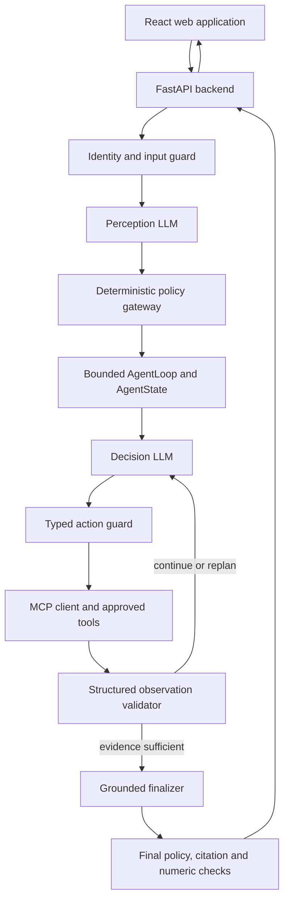
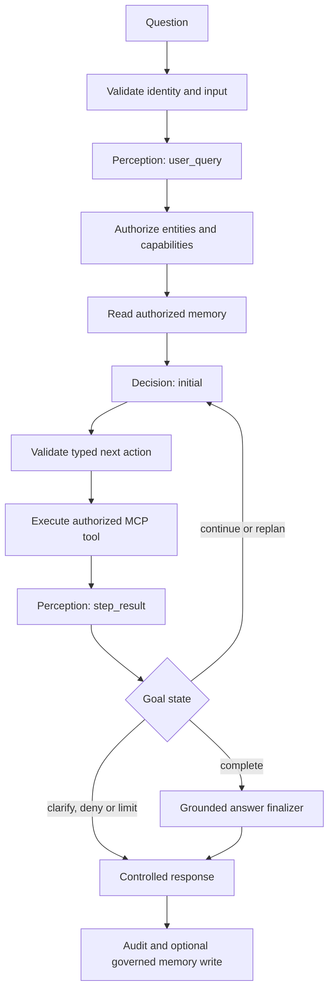

# Product Requirements Document

## Secure Multi-Tenant Portfolio Due-Diligence Copilot

**Document status:** Build-ready v2  
**Primary user:** Sagar, building and learning with Codex  
**Product type:** Modular single-agent cognitive loop with permission-aware RAG and MCP tools  
**Implementation style:** Incremental vertical slices with tests after every milestone  
**Data policy for MVP:** Synthetic data only  

**v2 architecture decision:** Adapt the EAG Perception → Decision → Execution → Perception loop as the visible reasoning backbone, but replace unrestricted code execution, shared memory, and implicit state with typed actions, deterministic authorization, bounded execution, scoped memory, structured observations, and auditable plan versions.

---

## 1. Purpose of this PRD

This PRD defines a small but credible investment portfolio copilot that demonstrates the difficult engineering requirements raised in the interview:

- multi-tenant isolation;
- Finance, Legal, and Shared department permissions;
- secure document ingestion and retrieval;
- grounded answers with citations;
- deterministic financial calculations;
- isolated user and department memory;
- cost-aware model routing;
- tool execution through MCP;
- separate Perception and Decision model calls with domain-specific prompts;
- a bounded observe-decide-act loop with failure-aware replanning;
- typed session state and visible plan versions;
- auditability and evaluation.

The PRD is deliberately organized into milestones. Codex must implement only one milestone at a time. Sagar must be able to run, inspect, test, and explain each milestone before approving the next one.

The goal is not to create a broad autonomous assistant. The goal is to prove that a useful portfolio question can be answered while unauthorized information never enters retrieval results, tools, memory, logs, caches, or the model prompt.

---

## 2. Product decision

Build a **modular single-agent agentic RAG copilot** inspired by the EAG cognitive loop.

The product deliberately uses separate Perception, Decision, and grounded-answer prompts. These are specialized LLM nodes inside one agent because they share one original goal, one trusted authorization scope, one `AgentState`, one bounded execution loop, and one final answer. Multiple prompts, model calls, or MCP servers do not by themselves make the system multi-agent.

The system is agentic because one controlled orchestrator can:

1. understand a user question;
2. read authorized memory;
3. classify the task;
4. select an MCP tool;
5. retrieve documents or financial data;
6. execute an approved calculation;
7. validate the result;
8. answer or refuse;
9. update authorized memory;
10. record an audit trace.

The EAG course implementation is a reference, not production code. Preserve its useful learning experience—Perception snapshots, plan text, Step 0 execution, observations, replanning, session traces, and MCP discovery—while rewriting its unsafe or incomplete parts.

The system is not multi-agent in the MVP. Retrieval, calculation, memory, authorization, validation, and summarization are services or workflow nodes, not separate agents.

### 2.1 Product invariant

> No document chunk, spreadsheet row, memory record, calculation input, cached result, or model context may be used unless it matches the authenticated user's effective authorization scope.

### 2.2 Design philosophy from EAG Session 9

> Use the LLM to understand people. Use heuristics to protect them.

LLMs handle fuzzy language, intent, query rewriting, tool selection from an allowed shortlist, and explanation. Deterministic code handles authentication, authorization, schemas, tenant filtering, calculations, retry limits, memory ACLs, audit logging, and cost limits.

---

## 3. Goals

### 3.1 MVP goals

- Allow an administrator to upload synthetic PDF and Excel files.
- Require the administrator to assign tenant, company, department, document type, and visibility before ingestion.
- Show ingestion status and a parsed-content preview.
- Store original files and searchable chunks with page, sheet, and row provenance.
- Authenticate seeded demo users and derive trusted tenant/department claims server-side.
- Ensure Finance cannot retrieve Legal-only information.
- Ensure Orion cannot retrieve Atlas information.
- Answer authorized questions with citations.
- Refuse unsupported or unauthorized questions without exposing restricted content.
- Perform approved financial calculations using Python functions or SQL, not LLM arithmetic.
- Store private and department memory with explicit ACLs and provenance.
- Display a developer trace showing policy decisions, selected route, tools, evidence, latency, and estimated cost.
- Display Perception snapshots, Decision plan versions, typed actions, structured observations, and stopping reasons in the developer trace.
- Support initial planning and mid-session replanning without executing arbitrary model-generated code.
- Enforce maximum steps, retries, replans, tool timeouts, and terminal states.
- Run a repeatable evaluation suite containing positive questions and deny tests.

### 3.2 Learning goals

After every milestone, Sagar must be able to explain:

- what the frontend sends;
- which backend endpoint receives it;
- how input is validated;
- which database rows are read or written;
- where authorization is enforced;
- when an LLM is called;
- when an MCP tool is called;
- what tests prove the feature;
- what would change in production.

### 3.3 Interview goals

The final demo should prove:

- useful authorized answers;
- department denial;
- tenant denial;
- isolated memory;
- deterministic calculation;
- cost-aware routing;
- citations and controlled abstention;
- traceability.

---

## 4. Non-goals for the MVP

Do not implement these during the first build:

- a multi-agent supervisor/worker architecture;
- autonomous writes to email, Drive, spreadsheets, or client systems;
- browser or computer-use agents;
- live Gmail or Google Drive synchronization;
- a knowledge graph or Neo4j;
- GraphAgent, TripletAgent, CriticAgent, or parallel agent variants;
- arbitrary shell access;
- unrestricted SQL generation;
- unrestricted model-generated Python execution;
- direct reuse of the EAG `run_user_code()` execution path;
- an unbounded `while step` agent loop;
- unrestricted exploratory/parallel planning as the default;
- fine-tuning;
- separate infrastructure stack for every tenant;
- production SSO, SCIM, or enterprise identity federation;
- complex user-created authorization policies;
- all file formats;
- real or confidential investment data.

These features may be discussed as future evolution but must not block the core demo.

---

## 5. Personas and demo identities

| Tenant | User | Department | Role | Allowed scope |
|---|---|---|---|---|
| Orion Capital | Alice | Finance | Analyst | Orion Finance + Orion Shared |
| Orion Capital | Leo | Legal | Counsel | Orion Legal + Orion Shared |
| Orion Capital | Maya | Investment Committee | Reviewer | Approved Orion Finance + Legal + Shared |
| Atlas Investments | Amir | Finance | Analyst | Atlas Finance + Atlas Shared |
| Atlas Investments | Lina | Legal | Counsel | Atlas Legal + Atlas Shared |
| Platform | Nora | Administration | Admin | Upload and manage synthetic documents for assigned tenants |

### 5.1 Demo restrictions

- Alice must never access Orion Legal-only content.
- Leo must never access Orion Finance-only content.
- No Orion user may access Atlas content or memory.
- A cross-functional user receives access only through explicit membership/entitlement records.
- Admin upload permission does not automatically grant permission to ask questions about all uploaded content.

---

## 6. Core user journeys

### 6.1 Administrator uploads and ingests a document

1. Nora signs in.
2. Nora opens **Document Ingestion**.
3. Nora selects tenant, company, department, visibility, and document type.
4. Nora uploads a PDF or Excel file.
5. The backend validates file type, size, uploader permission, and metadata.
6. The backend stores the original file and creates an ingestion job.
7. The parser extracts text, tables, page/sheet/row coordinates, and document metadata.
8. The frontend shows a preview before indexing.
9. Nora approves the preview.
10. The backend chunks, embeds, and stores searchable records with ACL metadata.
11. The document becomes `READY`.
12. The audit log records who uploaded, classified, approved, and indexed it.

### 6.2 Finance user asks an authorized question

1. Alice signs in.
2. The backend validates her token and resolves Orion Finance + Shared permissions.
3. Alice asks, “What were Orion's 2025 revenue and EBITDA?”
4. The orchestrator classifies the request as document/financial lookup.
5. Retrieval applies Orion + Finance/Shared filters before search.
6. Authorized chunks are returned with page/sheet/row citations.
7. The model generates a grounded answer from the evidence.
8. The validator checks citations and numeric consistency.
9. The response and trace are displayed.

### 6.3 Finance user asks for Legal-only information

1. Alice asks for a clause found only in Orion Legal.
2. Authorization scope remains Orion Finance + Shared.
3. Orion Legal chunks are excluded before retrieval.
4. The system finds no authorized evidence.
5. No restricted text enters the model prompt.
6. The system returns a controlled insufficient-authorized-evidence response.
7. The trace shows `DENIED_OR_NO_AUTHORIZED_EVIDENCE` without exposing restricted text.

### 6.4 User requests a calculation

1. Alice asks, “Calculate Orion's EBITDA margin for 2025.”
2. The orchestrator classifies the request as retrieval + calculation.
3. Authorized revenue and EBITDA values are retrieved.
4. The `calculate_financial_metric` MCP tool receives structured numeric inputs.
5. A deterministic formula calculates the margin.
6. The LLM explains the verified result and cites the source values.

### 6.5 User creates private memory

1. Alice says, “Remember that I prefer all amounts in crores.”
2. The LLM extracts a memory candidate.
3. The memory policy validates that it is safe and useful.
4. The system assigns `tenant=orion`, `owner=alice`, `visibility=private`.
5. Future Alice responses use crores.
6. Leo and Atlas users cannot retrieve the preference.

---

## 7. High-level architecture



### 7.1 Offline ingestion path


### 7.2 Live request path



### 7.3 Cognitive-loop component contracts

The EAG-style loop is a first-class product capability. Each component has one responsibility and a typed input/output contract.

| Component | LLM? | Responsibility | Must not do |
|---|---:|---|---|
| Input guard | No | Validate authentication, size, format, attachment IDs, rate limits, and prohibited raw paths/URLs | Interpret investment intent |
| Perception `user_query` | Yes | Extract financial intent, entities, expected result, required capabilities, ambiguity, and risk flags | Authorize, select tools, calculate, or answer from restricted data |
| Policy gateway | No | Build immutable `AuthorizationScope` and permitted capability shortlist | Trust identity or scope written in the user query |
| Memory reader | No/embedding | Retrieve only permitted private/workspace memories within a strict budget | Search global unscoped memory |
| Decision `initial` | Yes | Produce a one-to-three-step plan and one typed next action | Execute tools, change scope, generate Python/SQL, or invent tools |
| Action guard | No | Validate tool name, schema, company scope, limits, and state transition | Repair an unauthorized action silently |
| MCP executor | No | Invoke one approved tool with trusted scope injected out of band | Accept tenant/role as model-controlled arguments |
| Perception `step_result` | Yes | Interpret the structured observation and assess local/global progress | Treat unsupported text as evidence |
| Decision `mid_session` | Yes | Continue, replan, clarify, refuse, or finalize | Reuse a permanently denied action or exceed limits |
| Grounded finalizer | Yes | Explain validated evidence, calculations, conflicts, and limitations with citations | Add unsupported facts or authoritative arithmetic |
| Final validator | No plus optional judge | Check scope, citation references, numeric consistency, status, and output policy | Approve an answer containing unauthorized evidence |

### 7.4 Agent state

One request owns one typed `AgentState`:

```text
request_id
session_id
original_query
trusted_authorization_scope
initial_perception
authorized_memory
plan_versions[]
current_action
completed_steps[]
observations[]
evidence[]
calculation_results[]
step_count
retry_count
replan_count
model_route
status
stopping_reason
final_answer
```

The state object may contain references to authorized evidence. Trace views and logs must use sanitized summaries and IDs rather than copying confidential chunks.

### 7.5 Typed action contract

Replace EAG `CODE` steps and `raw_code_block` with:

```json
{
  "step_index": 0,
  "type": "TOOL_CALL",
  "description": "Retrieve Orion financial metrics for 2024 and 2025",
  "tool_name": "query_financial_metrics",
  "arguments": {
    "company": "Orion",
    "periods": ["2024", "2025"],
    "metrics": ["revenue", "EBITDA"]
  },
  "reason_code": "QUERY_METRICS"
}
```

Allowed action types are `TOOL_CALL`, `FINALIZE`, `CLARIFY`, and `REFUSE`. Authorization fields are never present in model-produced arguments.

### 7.6 Structured observation contract

Every executor result becomes an observation before returning to Perception:

```json
{
  "tool_name": "query_financial_metrics",
  "status": "success",
  "result": {},
  "evidence_refs": [],
  "calculation": null,
  "duration_ms": 0,
  "retryable": false,
  "error_type": null,
  "sanitized_error": null
}
```

### 7.7 State machine and execution limits

Terminal statuses are `COMPLETED`, `REFUSED`, `NEEDS_CLARIFICATION`, `INSUFFICIENT_EVIDENCE`, `LIMIT_REACHED`, and `FAILED`.

MVP defaults:

- conservative planning strategy;
- maximum four tool steps;
- maximum one retry for a transient tool failure;
- maximum one semantic retrieval rewrite;
- maximum one replan after an unhelpful step;
- per-tool timeout;
- no retry for authorization denial;
- no final answer produced merely because plan text has no remaining steps.

---

## 8. Recommended technical stack

### 8.1 Frontend

- React + TypeScript + Vite
- React Router
- TanStack Query for server state
- A small component system such as shadcn/ui or equivalent
- Zod for client-side form validation
- Vitest + React Testing Library
- Playwright for end-to-end tests

### 8.2 Backend

- Python 3.12+
- FastAPI
- Pydantic v2
- SQLAlchemy 2
- Alembic migrations
- PostgreSQL
- pgvector
- pytest
- httpx/TestClient for API integration tests
- MCP Python SDK / FastMCP-compatible implementation

### 8.3 Local infrastructure

- Docker Compose for PostgreSQL + pgvector
- Local filesystem object-store adapter for development
- Provider interfaces for embeddings and LLMs
- Synthetic seed script

### 8.4 Production evolution

- S3 for original files
- RDS PostgreSQL with pgvector or a policy-aware managed search service
- Bedrock or another approved model provider
- AgentCore Code Interpreter only for open-ended spreadsheet analysis
- CloudWatch/OpenTelemetry for traces and metrics
- Cognito or enterprise IdP for identity
- SQS/worker for ingestion jobs
- IAM roles and Secrets Manager

The MVP must keep cloud dependencies behind interfaces so local development remains possible.

---

## 9. Repository structure

```text
portfolio-copilot/
├── PRD.md
├── README.md
├── IMPLEMENTATION_STATUS.md
├── LEARNING_NOTES.md
├── docs/
│   ├── architecture.md
│   ├── security-invariants.md
│   ├── data-model.md
│   ├── testing-guide.md
│   └── demo-script.md
├── references/
│   └── eag/
│       ├── README.md
│       └── selected_reference_files_only/
├── backend/
│   ├── app/
│   │   ├── main.py
│   │   ├── api/
│   │   ├── auth/
│   │   ├── policies/
│   │   ├── ingestion/
│   │   ├── retrieval/
│   │   ├── orchestration/
│   │   │   ├── agent_loop.py
│   │   │   ├── agent_state.py
│   │   │   ├── state_machine.py
│   │   │   └── limits.py
│   │   ├── perception/
│   │   │   ├── service.py
│   │   │   ├── models.py
│   │   │   └── prompts/
│   │   ├── decision/
│   │   │   ├── service.py
│   │   │   ├── models.py
│   │   │   └── prompts/
│   │   ├── execution/
│   │   │   ├── action_guard.py
│   │   │   ├── executor.py
│   │   │   ├── observations.py
│   │   │   └── retry_policy.py
│   │   ├── mcp/
│   │   ├── memory/
│   │   ├── calculations/
│   │   ├── finalization/
│   │   ├── evaluation/
│   │   ├── observability/
│   │   ├── models/
│   │   └── db/
│   ├── tests/
│   │   ├── unit/
│   │   ├── integration/
│   │   ├── security/
│   │   └── evaluation/
│   └── pyproject.toml
├── frontend/
│   ├── src/
│   │   ├── routes/
│   │   ├── components/
│   │   ├── features/
│   │   ├── api/
│   │   └── types/
│   └── tests/
├── synthetic_data/
│   ├── orion/
│   ├── atlas/
│   ├── ground_truth/
│   └── seed_manifest.json
├── scripts/
│   ├── seed_demo.py
│   ├── reset_demo.py
│   └── run_evaluation.py
└── docker-compose.yml
```

### 9.1 Reference-code rule

EAG files placed in `references/eag/` are read-only references. Production code must not import from this directory. Codex must explain which idea it adopts and rewrite it to match this product's security and test requirements.

---

## 10. Which EAG code to give Codex

Do not provide the complete Session 1–17 repository initially. Give Codex only the files relevant to the current milestone.

### 10.1 Reuse/adapt

| EAG session | Give Codex | Purpose in this product | When to provide |
|---|---|---|---|
| Session 4 | Minimal MCP server, client, tool registration, and inspector example | MCP foundation | Milestone 6 |
| Session 6 | Pydantic models, perception, memory, decision, action, and main loop | Cognitive-layer boundaries | Milestone 0, then relevant file per milestone |
| Session 7 | Embedding, FAISS top-k, chunk/metadata mapping, short/long memory examples | Conceptual retrieval and memory reference | Milestones 3, 4, and 8 |
| Session 8 | Safe tool schemas, PDF parser, OCR, SELECT-only SQL, bounded Python/math tool | Ingestion and tool-safety reference | Milestones 2, 5, 6, 7, and 11 |
| Session 9 | Heuristics, conservative strategy, retry limits, typed planning state | Hybrid decision policy | Milestone 6 |
| Session 10 `S10SHARE` | `AgentLoop`, `AgentSession`, Perception/Decision classes and prompts, `MultiMCP`, executor, heuristics, and session trace | Primary orchestration reference; rewrite rather than import | Milestone 6 |
| Session 11 | Retrieval scoring, structured global state, traceable plan nodes | Evidence/trace ideas only | Milestones 4 and 9 |
| Session 17 | `flow.py`, structured execution results, timeout/retry, session trace, replay ideas | Resilient orchestration | Milestone 9 |

### 10.2 Do not provide initially

| Session/code | Reason to exclude |
|---|---|
| Sessions 1–2 model internals | Not required for application MVP |
| Session 11 GraphAgent/TripletAgent/multi-agent roles | Adds graph and coordination complexity |
| Session 12 browser agent | No browser automation requirement |
| Session 13 computer agent | No computer-control requirement |
| Session 15 super-agent architecture | Conflicts with minimal controlled MVP |
| Session 17 parallel plan variants | Increases cost, latency, and debugging complexity |
| Session 10 `run_user_code()` and `raw_code_block` | Executes unrestricted model-generated code; replace with typed actions |
| Session 10 global/unscoped memory search | Cannot enforce tenant, department, user, or provenance boundaries |
| Session 10 unbounded `while step` loop | Missing explicit step, retry, replan, timeout, and terminal-state controls |
| Unrestricted shell tools | Unsafe and irrelevant |
| Gmail/Telegram write tools | Outside read-only demo scope |

### 10.3 File-intake process for every milestone

Before starting a milestone:

1. Create `references/eag/milestone-N/`.
2. Copy only the 2–6 relevant EAG files into it.
3. Add a short `README.md` describing the session and expected reusable idea.
4. Ask Codex to inspect those files and produce a reuse report.
5. Codex must identify:
   - reusable concept;
   - unsafe/outdated assumption;
   - required rewrite;
   - tests missing from the course code.
6. Approve the report before Codex writes production code.

For Milestone 6, provide only these Session 10 reference files rather than the whole class repository:

- the `AgentLoop` file;
- `AgentSession`, `PerceptionSnapshot`, `Step`, and `ToolCode` models;
- Perception service and prompt;
- Decision service and prompt;
- `MultiMCP` and one minimal MCP server;
- the heuristic class;
- `run_user_code()` only as an explicit unsafe example to replace;
- session logging/trace code.

The Milestone 6 reuse report must explicitly identify: duplicated initial memory input, missing authorization, unrestricted code execution, `pdb.set_trace()`, unbounded looping, incomplete terminal state, unscoped memory, loss of structured tool metadata, and plan-history behavior.

### 10.4 Session 10 adoption matrix

| Course feature | Product decision | Required product change |
|---|---|---|
| Separate Perception prompt | Adopt | Replace generic ERORLL with investment-domain typed schema and brief rationale fields |
| `user_query` and `step_result` modes | Adopt | Pass structured observations rather than raw result strings |
| Separate Decision prompt | Adopt | Emit typed action, not source code |
| Initial and mid-session planning | Adopt | Preserve completed steps and enforce plan-version invariants |
| Natural-language `plan_text` | Adopt | Use for trace/explanation; never execute plan text directly |
| Execute only Step 0 | Adopt | Validate one next action through ActionGuard before execution |
| `AgentSession` and snapshots | Adapt | Replace implicit dictionaries with typed `AgentState` and sanitized trace DTOs |
| Failure memory | Adapt | Use typed transient failure history scoped to one request; do not inject arbitrary old failures |
| Live session trace | Adopt | Expose sanitized frontend timeline and observability events |
| `MultiMCP` | Adapt | Treat as approved tool registry/client; inject trusted scope out of band |
| Query heuristics | Rewrite | Use objective input/security guards; remove naive blacklist, local-path probing, and direct URL requests |
| `run_user_code()` | Reject | Use typed tool action executor; sandbox only for the later spreadsheet milestone |
| `pdb.set_trace()` | Reject in runtime | Use tests, structured logs, and optional development breakpoints |
| Global FAISS memory | Reject | Use metadata-first tenant/user/department filters and permission inheritance |
| Unlimited `while step` | Reject | Use bounded deterministic state machine |
| Exploratory default | Reject for MVP | Use conservative sequential planning; enable controlled parallelism only later |

---

## 11. Data ingestion product requirements

Yes, the MVP should include uploading data. This is the clearest way to demonstrate where security metadata, chunks, embeddings, and citations come from.

### 11.1 Supported file types

MVP:

- text-based PDF;
- XLSX;
- CSV.

Stretch:

- scanned PDF with OCR;
- EML email export;
- Drive export package.

### 11.2 Upload form fields

- Tenant: required, limited to admin's manageable tenants.
- Portfolio company: required.
- Department: Finance, Legal, or Shared.
- Visibility: Private department, Shared, or explicit workspace.
- Document type: Financial report, Legal agreement, Policy, Email, Spreadsheet, Other.
- Reporting period: optional.
- Effective date: optional.
- File: required.

The backend must ignore or reject unauthorized tenant/department assignments even if the browser submits them.

### 11.3 Ingestion states

```text
UPLOADED
-> VALIDATING
-> PARSING
-> PREVIEW_READY
-> APPROVED
-> CHUNKING
-> EMBEDDING
-> READY

Failure states:
VALIDATION_FAILED
PARSING_FAILED
INDEXING_FAILED
REJECTED
```

### 11.4 Preview requirements

The frontend must show:

- original filename;
- detected document type;
- number of pages or sheets;
- extracted text/table preview;
- proposed chunks;
- provenance fields;
- assigned tenant/department/visibility;
- warnings;
- Approve and Reject actions.

### 11.5 Chunk requirements

Each chunk must contain:

```text
chunk_id
tenant_id
company_id
department
visibility
document_id
document_version
source_type
page_number or sheet_name/row_range
content
embedding
content_hash
created_at
deleted_at
```

Never create an embedding without storing the corresponding security and citation metadata.

### 11.6 Update and deletion

- Re-uploading a document creates a new version.
- Old chunks become inactive before new chunks become searchable.
- Deleting a document removes it from retrieval immediately.
- Deletion must eventually remove raw files, chunks, embeddings, caches, and derived memory references.
- The MVP may implement soft deletion plus a cleanup command.

---

## 12. Authentication and authorization requirements

### 12.1 MVP authentication

- Seed users with hashed development passwords.
- Issue signed short-lived JWTs.
- Validate signature, issuer, audience, expiry, and user status.
- Resolve memberships from the database on each new session.

### 12.2 Trusted authorization scope

The backend creates:

```json
{
  "tenant_id": "orion",
  "user_id": "alice",
  "departments": ["finance", "shared"],
  "company_ids": ["orion-main", "orion-portfolio-a"],
  "roles": ["analyst"]
}
```

The client may not supply or override its effective scope.

### 12.3 Defence in depth

- API policy check.
- Repository methods require an `AuthorizationScope` parameter.
- Retrieval applies pre-filtering.
- Memory applies pre-filtering.
- Tool executor injects trusted scope out of band.
- Optional database row-level security in a later milestone.
- Cross-tenant tests run in CI.

### 12.4 Deny behavior

- Missing or conflicting scope: fail closed.
- Unauthorized document ID: return 404 or generic forbidden result without confirming existence.
- No authorized evidence: controlled abstention.
- Never include restricted text in error messages, traces, or logs.

---

## 13. Data model

### 13.1 Core entities

#### Tenant

```text
id, name, status, created_at
```

#### User

```text
id, email, display_name, password_hash, status, created_at
```

#### Membership

```text
id, user_id, tenant_id, department, role, allowed_company_ids, status
```

#### Document

```text
id, tenant_id, company_id, department, visibility, filename,
document_type, version, status, storage_key, checksum, uploaded_by,
approved_by, created_at, deleted_at
```

#### DocumentChunk

```text
id, document_id, tenant_id, company_id, department, visibility,
page_number, sheet_name, row_start, row_end, content, embedding,
content_hash, version, active
```

#### Conversation

```text
id, tenant_id, user_id, title, created_at, last_activity_at
```

#### Message

```text
id, conversation_id, tenant_id, user_id, role, content,
request_id, created_at
```

#### Memory

```text
id, tenant_id, owner_type, owner_id, conversation_id,
allowed_departments, allowed_workspace_ids, visibility, memory_type,
content, embedding, source_document_ids, source_message_ids,
confidence, sensitivity, created_at, expires_at, deleted_at
```

#### RequestTrace

```text
id, request_id, tenant_id, user_id, conversation_id, intent,
policy_decision, route, tool_calls, retrieved_document_ids,
model, input_tokens, output_tokens, estimated_cost, latency_ms,
validation_status, final_status, stopping_reason, step_count,
retry_count, replan_count, created_at
```

#### AgentRun

```text
id, request_id, session_id, tenant_id, user_id, conversation_id,
authorization_scope_fingerprint, initial_perception_json,
model_route, planning_strategy, status, stopping_reason,
started_at, completed_at
```

#### PlanVersion

```text
id, agent_run_id, version_number, plan_text_json,
change_reason_code, created_at
```

#### AgentStep

```text
id, agent_run_id, plan_version_id, step_index, action_type,
description, tool_name, sanitized_arguments_json, status,
reason_code, started_at, completed_at
```

#### ObservationRecord

```text
id, agent_step_id, tool_name, status, evidence_reference_ids,
calculation_reference_id, duration_ms, retryable, error_type,
sanitized_error, perception_summary_json, created_at
```

#### AuditEvent

```text
id, tenant_id, actor_user_id, event_type, resource_type,
resource_id, decision, metadata_without_sensitive_content, created_at
```

#### EvaluationCase

```text
id, question, actor_user_id, expected_status,
expected_document_ids, forbidden_document_ids,
reference_answer, tags
```

---

## 14. MCP tool requirements

MVP should use one `portfolio_mcp_server` with a small tool registry. Split into multiple servers only when security ownership or deployment requirements justify it.

`MultiMCP` is an MCP client/registry abstraction, not a multi-agent system. It may aggregate tools from multiple approved servers, but the AgentLoop remains the single owner of the request goal and state.

### 14.1 Security rule for all MCP tools

Do not expose `tenant_id`, role, or allowed departments as model-controlled arguments.

The MCP host injects a trusted authorization context into every tool call. The tool revalidates the scope before accessing data.

The Decision node returns a typed tool name and arguments. It never returns executable source code. Before execution, `ActionGuard` verifies:

- the tool exists in the request's authorized shortlist;
- arguments satisfy the registered input schema;
- company/document/file IDs fall within effective scope;
- action and retry limits are not exceeded;
- required read-only or sandbox restrictions are active.

Every tool returns a common envelope containing status, structured result, evidence references, duration, retryability, and sanitized error metadata.

### 14.2 Tool: `search_authorized_documents`

Input:

```json
{
  "query": "string",
  "top_k": 5,
  "company_ids": ["optional-known-company-id"],
  "document_types": ["optional"]
}
```

Output:

```json
{
  "status": "success",
  "results": [
    {
      "chunk_id": "...",
      "document_id": "...",
      "content": "...",
      "page": 7,
      "sheet": null,
      "row_range": null,
      "score": 0.83
    }
  ]
}
```

### 14.3 Tool: `get_document_excerpt`

Returns an authorized excerpt from an already authorized document ID and location.

### 14.4 Tool: `query_financial_metrics`

Retrieves structured financial values from authorized spreadsheet/table records.

### 14.5 Tool: `calculate_financial_metric`

Accepts an approved metric enum and numeric inputs. Initial approved metrics:

- EBITDA margin;
- revenue growth;
- net profit margin;
- debt-to-equity;
- cash runway;
- CAGR.

The tool returns formula, inputs, units, result, and validation warnings.

### 14.6 Tool: `search_memory`

Returns only private memories owned by the authenticated user and authorized department/workspace memories.

### 14.7 Tool: `write_memory`

Accepts a candidate and requested visibility. The server calculates effective ACL, provenance, and retention. It may reject the write.

### 14.8 Stretch tool: `analyze_spreadsheet`

Use only after fixed calculators work. It accepts an authorized file ID and a constrained analysis request. Dynamic code runs in an isolated sandbox with no public network, scoped read-only files, time/memory/output limits, and no credentials.

### 14.9 Tools that are forbidden in the MVP

- `run_shell(command)`
- `run_python(code)` without sandbox and policy
- `run_sql(sql)` without SELECT-only parser and scope injection
- `read_file(path)` with arbitrary path
- any write-enabled email, Drive, browser, or operating-system tool

---

## 15. Heuristic versus LLM ownership

| Operation | Owner |
|---|---|
| Understand question | LLM |
| Correct typos and ambiguity | LLM |
| Extract intent/entities | LLM, then Pydantic validation |
| Authenticate user | Deterministic |
| Build authorization scope | Deterministic |
| Apply tenant/department ACL | Deterministic |
| Shortlist allowed tools | Deterministic |
| Choose among safe tools | LLM or deterministic route |
| Rewrite retrieval query | LLM |
| Retrieve vector/keyword results | Search engine with deterministic filters |
| Calculate financial result | Python/SQL |
| Generate explanation | LLM |
| Validate numeric consistency | Deterministic |
| Validate citation structure | Deterministic |
| Assess semantic faithfulness | LLM judge plus deterministic evidence checks |
| Trigger refusal | Deterministic |
| Phrase refusal | LLM/template |
| Extract memory candidate | LLM |
| Assign memory ACL/TTL | Deterministic |
| Retry/timeout/cost limit | Deterministic |
| Decide whether a transient failure should be retried | Deterministic policy using typed error class |
| Interpret whether a successful result advances the user's goal | Perception LLM, then schema validation |
| Create/revise a short plan | Decision LLM within deterministic limits |
| Validate state transition and stopping condition | Deterministic state machine |
| Audit | Deterministic |

---

## 16. Memory requirements

### 16.1 Memory types

- **Working memory:** last few turns and rolling summary for one conversation.
- **Private user memory:** preferences and explicit private notes.
- **Department/workspace memory:** approved shared conclusions with ACLs.
- **Operational history:** tool outcomes and trace data; not injected by default.

### 16.2 Memory read path

1. Revalidate user membership.
2. Build effective scope.
3. Pre-filter memory by tenant, owner, department, workspace, sensitivity, and expiry.
4. Rank permitted candidates by relevance, recency, and importance.
5. Remove stale or conflicting items.
6. Inject only a small memory budget.

### 16.3 Memory write path

1. LLM extracts a candidate.
2. Reject secrets, restricted content, or unsupported conclusions.
3. Determine source provenance.
4. Inherit ACL from all sources.
5. Deduplicate and identify conflicts.
6. Assign owner, visibility, sensitivity, and expiry.
7. Store and audit.

### 16.4 Source-permission inheritance

A memory derived from Finance-only evidence cannot become Shared or Legal-visible. A derived memory's effective ACL must be at least as restrictive as the intersection of its source permissions.

### 16.5 Do not store

- raw chain-of-thought;
- passwords or API credentials;
- entire retrieved documents;
- unauthorized content;
- unsupported model claims;
- calculation results without inputs and source references;
- all chats forever.

---

## 17. Frontend requirements

### 17.1 Login page

- Email/password login.
- Optional demo-account cards clearly labelled development-only.
- Display active tenant, department, and role after login.

### 17.2 Document ingestion page

- Upload form with required classification fields.
- Progress states.
- Parsing preview.
- Approve/reject actions.
- Error explanations without stack traces.

### 17.3 Document library page

- List only manageable or viewable documents.
- Filter by tenant/company/department/type/status.
- Display version, status, page/sheet count, and uploader.
- Open parsed preview and citations.

### 17.4 Copilot workspace

- Conversation list.
- Chat input.
- Suggested demo questions.
- Answer with inline citations.
- Evidence drawer with document, page/sheet/row, and excerpt.
- Clear controlled-refusal state.
- Route badge: Retrieval, Calculation, Complex Synthesis, or Refusal.

### 17.5 Developer trace drawer

Development/demo mode only:

- authenticated scope;
- initial and step-result Perception snapshots;
- policy decision;
- permitted tool shortlist;
- Decision plan versions with changed steps highlighted;
- typed next action and reason code;
- selected MCP tool and executor status;
- sanitized tool input/output;
- structured observations and local/global goal status;
- step, retry, and replan counters;
- terminal status and stopping reason;
- retrieved document IDs and scores;
- model route;
- validation checks;
- tokens, cost estimate, and latency.

Never show restricted content that was excluded by policy.

### 17.6 Memory inspector

- Show current user's private memory.
- Show authorized shared memory.
- Display owner, visibility, source, created date, and expiry.
- Delete/correct user-owned memory.
- Demonstrate that another user cannot see it.

### 17.7 Evaluation dashboard

- Run evaluation suite.
- Show authorization deny pass rate.
- Show retrieval recall@k.
- Show citation precision.
- Show answer correctness/faithfulness.
- Show abstention quality.
- Show average latency and cost.

---

## 18. API requirements

Initial endpoint set:

```text
POST   /api/auth/login
GET    /api/auth/me

POST   /api/admin/documents
GET    /api/admin/ingestion/{job_id}
GET    /api/admin/documents/{document_id}/preview
POST   /api/admin/documents/{document_id}/approve
POST   /api/admin/documents/{document_id}/reject
DELETE /api/admin/documents/{document_id}

GET    /api/documents
GET    /api/documents/{document_id}/citation

POST   /api/conversations
GET    /api/conversations
POST   /api/conversations/{conversation_id}/messages
GET    /api/requests/{request_id}/trace
GET    /api/requests/{request_id}/events

GET    /api/memories
PATCH  /api/memories/{memory_id}
DELETE /api/memories/{memory_id}

POST   /api/admin/evaluations/run
GET    /api/admin/evaluations/{run_id}
```

Every protected endpoint must derive scope from authentication, not request-body identity fields.

The message endpoint returns a `request_id`. The optional events endpoint may stream sanitized state transitions to the developer trace. The trace API must never return hidden reasoning, raw system prompts, unrestricted memory content, secrets, or evidence excluded by policy.

---

## 19. Model-routing requirements

### 19.1 Routes

| Request class | Route |
|---|---|
| Simple lookup with clear evidence | Economical model + RAG |
| Entity/metric extraction | Economical model or structured parser |
| Financial calculation | SQL/Python calculator, then economical explanation |
| Multi-document comparison | Stronger model + authorized RAG |
| Complex ambiguity/conflicting evidence | Stronger model with explicit conflict reporting |
| Unauthorized/no evidence | No generation or controlled refusal template |

### 19.2 Router design

Start with deterministic rules over a typed perception result. Do not integrate multiple providers in the first milestone. Store route choice as configuration so another model can be added later.

### 19.3 Cost controls

- Maximum top-k.
- Maximum context tokens.
- Maximum output tokens.
- One model retry at most.
- No model call on clear authorization denial.
- Cache keys include tenant, effective scope fingerprint, source version, model, and request fingerprint.
- Display cost estimate in trace.

---

## 20. Evaluation requirements

### 20.1 Synthetic evaluation pack

Minimum dataset:

- two tenants;
- Finance, Legal, and Shared documents;
- at least four users;
- two finance spreadsheets;
- two legal PDFs;
- two shared policies;
- at least 20 ground-truth questions;
- at least 10 explicit deny tests;
- at least four memory-isolation tests;
- at least four calculation tests;
- at least four insufficient-evidence tests.

### 20.2 Metrics

| Metric | MVP target |
|---|---|
| Cross-tenant deny pass rate | 100% |
| Cross-department deny pass rate | 100% |
| Memory-isolation pass rate | 100% |
| Calculation exactness | 100% on approved formulas |
| Retrieval recall@5 | >= 90% on curated cases |
| Citation presence | 100% for factual answers |
| Citation support precision | >= 90% after review |
| Abstention correctness | >= 90% |

Security targets are release gates, not averages. One confirmed cross-tenant leak blocks release.

### 20.3 Test layers

- Unit tests for policy, schemas, calculators, memory ACLs, and parsers.
- Repository tests proving mandatory scope filters.
- API integration tests for positive and deny flows.
- MCP contract tests for input/output schemas and errors.
- Agent-loop transition tests covering initial perception, direct completion, tool success, useful partial result, replan, clarification, refusal, timeout, limit reached, and finalization.
- Prompt contract tests proving Perception cannot authorize and Decision cannot emit arbitrary code or authorization fields.
- Retrieval tests with known chunk IDs.
- LLM evaluation with deterministic checks and sampled human review.
- Playwright tests for login, upload, chat, denial, citations, and memory.

---

## 21. Milestone plan

Each milestone is a working vertical slice. Codex must stop after completing the milestone's definition of done.

### Milestone 0 - Repository, contracts, and learning harness

Build:

- monorepo structure;
- FastAPI health endpoint;
- React application shell;
- Docker Compose PostgreSQL/pgvector;
- migration setup;
- shared API error format;
- `IMPLEMENTATION_STATUS.md` and `LEARNING_NOTES.md`;
- CI commands for backend/frontend tests.

EAG reference:

- Session 6 Pydantic models and cognitive-layer concepts only.

Definition of done:

- frontend loads;
- backend health check succeeds;
- database migration runs;
- one frontend and one backend test pass;
- documentation explains the request path.

Do not add an LLM, MCP, RAG, memory, or upload yet.

### Milestone 1 - Identity, tenancy, and authorization

Build:

- tenant/user/membership schema;
- seeded identities;
- login and JWT validation;
- `/auth/me`;
- policy service and `AuthorizationScope` model;
- login page and active-scope display;
- deny tests.

Definition of done:

- Alice receives Orion Finance + Shared scope;
- Leo receives Orion Legal + Shared scope;
- Atlas users receive only Atlas scope;
- a forged client tenant value has no effect;
- tests prove tenant and department rules.

Do not add document upload or LLM calls.

### Milestone 2 - Document upload, parsing, and preview

Build:

- document and ingestion-job schema;
- admin upload API;
- PDF/XLSX/CSV validation;
- local object storage adapter;
- parser interfaces;
- page/sheet/row provenance;
- preview/approve/reject workflow;
- upload and preview frontend.

EAG reference:

- Session 8 PDF parsing and safe input-validation examples.

Definition of done:

- admin uploads one PDF and one Excel file;
- invalid type/size is rejected;
- unauthorized tenant classification is rejected;
- extracted preview displays page/sheet provenance;
- no embeddings or LLM required.

### Milestone 3 - Secure chunk storage and deterministic search

Build:

- document-chunk schema;
- deterministic chunker;
- metadata and ACL propagation;
- keyword search baseline;
- document library frontend;
- authorized search debug page;
- cross-tenant and cross-department repository tests.

EAG reference:

- Session 7 chunk/metadata mapping.

Definition of done:

- Alice's search cannot return Orion Legal or Atlas chunks;
- Leo's search cannot return Orion Finance chunks;
- citations identify page/sheet/row;
- restrictions are enforced in backend repository code, not UI.

### Milestone 4 - Embeddings, hybrid retrieval, and citations

Build:

- embedding-provider interface;
- local/default development embedding adapter;
- pgvector indexing;
- hybrid keyword + vector search;
- optional reranking interface;
- retrieval trace with scores;
- retrieval ground-truth tests.

EAG reference:

- Session 7 embeddings/top-k;
- Session 8 semantic chunking as reference, not mandatory implementation;
- Session 11 retrieval scoring.

Definition of done:

- top-k authorized results are returned;
- known questions retrieve expected chunk IDs;
- metadata filter is applied before results reach the caller;
- retrieval recall@5 is measured.

No generative answer required yet.

### Milestone 5 - Grounded RAG chat

Build:

- conversations/messages schema;
- LLM-provider interface;
- one model integration;
- prompt with authorized evidence only;
- citation rendering;
- controlled insufficient-evidence response;
- chat UI and evidence drawer;
- trace with model tokens/latency.

Definition of done:

- authorized question produces cited answer;
- unsupported question abstains;
- restricted question reveals no restricted content;
- every factual answer includes valid citations;
- tests can use a fake LLM for determinism.

### Milestone 6 - MCP tools and single-agent orchestration

Build:

- an EAG-inspired but production-safe `AgentLoop`;
- typed `AgentState`, `PlanVersion`, `Step`, `Action`, `Observation`, and terminal-status models;
- Perception service with separate `user_query` and `step_result` modes;
- investment-domain Perception prompt and strict structured output;
- Decision service with separate `initial` and `mid_session` modes;
- investment-domain Decision prompt, one-to-three-step plan text, and one next action;
- deterministic input guard, policy gateway, permitted capability shortlist, and action guard;
- MCP server/client integration and inspectable tool schemas;
- `search_authorized_documents` and `get_document_excerpt` MCP tools;
- `TOOL_CALL`, `FINALIZE`, `CLARIFY`, and `REFUSE` actions;
- structured observation envelope preserving tool, evidence, error, timing, and retry metadata;
- conservative strategy as the default;
- bounded step, retry, replan, timeout, and terminal-state controls;
- sanitized plan-version and session trace;
- frontend trace timeline showing Perception → Policy → Decision → Action → Observation → Decision/Finalization.

EAG reference:

- Session 4 minimal MCP server/client;
- Session 6 perception/decision/action;
- Session 8 Pydantic tools and discovery;
- Session 9 heuristics/conservative strategy;
- Session 10 `S10SHARE` AgentLoop, AgentSession, Perception, Decision, MultiMCP, prompts, heuristics, and live trace.

Required rewrites from Session 10:

- replace `CODE` and `raw_code_block` with typed actions;
- replace `run_user_code()` with an allow-listed executor;
- remove unconditional `pdb.set_trace()`;
- pass initial memory once rather than duplicating it;
- scope memory by tenant/user/department/workspace and source permissions;
- preserve the complete structured tool result instead of only `result` text;
- add trusted authorization before memory, retrieval, and every tool call;
- retain completed steps across plan versions;
- mark an explicit terminal state when the plan is exhausted;
- enforce maximum steps, retries, replans, and timeouts;
- never retry authorization denial;
- never treat Perception's direct answer as final without final validation.

Definition of done:

- tool schemas are inspectable;
- Perception and Decision run as separate model calls with separately testable prompts and schemas;
- LLM selects only from the request's allowed tool shortlist;
- scope is injected by host, not model arguments;
- no model-produced source code is executed;
- tool output returns as a structured observation to step-result Perception;
- Decision can continue, replan once, clarify, refuse, or finalize;
- plan versions and state transitions are visible in the developer trace;
- unknown tool, invalid input, timeout, transient error, denial, exhausted plan, and execution-limit cases are tested;
- the request always stops in an explicit terminal state;
- a fake Perception, fake Decision, and fake MCP executor can test the loop deterministically.

### Milestone 7 - Financial data and deterministic calculations

Build:

- normalized financial metric records from Excel;
- `query_financial_metrics` MCP tool;
- `calculate_financial_metric` MCP tool;
- approved formula registry;
- units/currency validation;
- retrieval + calculation route;
- frontend calculation breakdown.

EAG reference:

- Session 8 safe Python/math and SELECT-only SQL principles.

Definition of done:

- EBITDA margin calculation is exact;
- result shows formula, inputs, units, and sources;
- division-by-zero and missing-value behavior is tested;
- LLM never supplies authoritative arithmetic.

### Milestone 8 - Isolated memory

Build:

- memory schema;
- candidate extraction;
- deterministic memory policy;
- ACL/source inheritance;
- `search_memory` and `write_memory` MCP tools;
- private preference demonstration;
- memory inspector and deletion;
- memory-isolation tests.

EAG reference:

- Session 7 short/long memory and semantic retrieval;
- Session 9 memory-aware planning principles.

Definition of done:

- Alice's preference is available to Alice;
- Leo and Atlas cannot retrieve it;
- Finance-derived memory cannot become Legal/Shared without policy approval;
- expired/deleted memory is not returned;
- source access is rechecked on every read.

### Milestone 9 - Validation, evaluation, and observability

Build:

- structured request state;
- policy/evidence/tool/model trace;
- deterministic numeric/citation validation;
- optional semantic faithfulness judge;
- evaluation runner and dashboard;
- sanitized audit log;
- replayable request trace.

EAG reference:

- Session 11 structured global state and traceability;
- Session 17 flow, structured outputs, timeouts, retry, and session tracing.

Definition of done:

- deny suite passes 100%;
- retrieval and citation metrics are visible;
- traces distinguish planning, retrieval, tool, and model failures;
- logs contain IDs and decisions, not confidential source text.

### Milestone 10 - Model routing and cost controls

Build:

- deterministic route rules;
- economical and strong model adapters or simulated second route;
- context/token budgets;
- permission-safe cache design;
- cost dashboard.

Definition of done:

- calculation route uses a deterministic tool;
- simple lookup uses economical route;
- complex comparison uses strong route;
- refusal avoids unnecessary model call;
- route/cost are visible and tested.

### Milestone 11 - Optional spreadsheet sandbox

Only begin after Milestones 0–10 pass.

Build:

- isolated sandbox adapter;
- no-network default;
- authorized file staging;
- time/memory/output limits;
- approved library set;
- code/output trace;
- automatic cleanup.

Definition of done:

- arbitrary host filesystem and network access fail;
- infinite loop is terminated;
- only authorized spreadsheet is visible;
- generated result is reproducible;
- fixed calculator remains preferred for known formulas.

### Milestone 12 - Demo hardening and optional AWS deployment

Build:

- synthetic reset script;
- demo accounts and questions;
- fallback screenshots/video;
- production architecture document;
- deployment pipeline;
- secrets/IAM configuration;
- monitoring.

Do not copy the EAG rsync/SSH deployment literally. Use IAM roles, secret management, restricted networking, and a repeatable deployment process.

---

## 22. Codex operating contract

Codex must follow these rules for every milestone.

### 22.1 Before coding

Codex must:

1. read `PRD.md`, `IMPLEMENTATION_STATUS.md`, and the current milestone's EAG references;
2. inspect the existing repository and uncommitted changes;
3. state the exact milestone and acceptance criteria;
4. list files it plans to create or modify;
5. explain the backend request/data flow;
6. explain the frontend state/UI flow;
7. identify security and failure cases;
8. wait only if a decision materially changes the product.

### 22.2 During coding

Codex must:

- implement only the active milestone;
- preserve unrelated user changes;
- write tests alongside the feature;
- keep authorization logic out of prompts;
- use typed schemas between layers;
- avoid unnecessary abstractions;
- avoid replacing understandable code with a large black-box framework;
- preserve the visible Perception → Decision → Action → Observation learning boundaries;
- use the selected EAG files as references and document every adopted/rejected pattern;
- use fakes/mocks for deterministic tests;
- keep provider integrations behind interfaces;
- update migrations and seed data when needed.

### 22.3 After coding

Codex must:

1. run unit, integration, frontend, and relevant security tests;
2. report exact commands and outcomes;
3. provide manual test steps;
4. explain one successful request end to end;
5. explain one denied request end to end;
6. identify database rows written/read;
7. identify every LLM and MCP call;
8. update `IMPLEMENTATION_STATUS.md`;
9. append a concise learning note to `LEARNING_NOTES.md`;
10. stop and request approval before the next milestone.

### 22.4 Prohibited Codex behavior

Codex must not:

- implement multiple future milestones “for completeness”;
- introduce multi-agent architecture;
- expose tenant/role as model-controlled tool arguments;
- execute arbitrary Python or shell on the host;
- import production modules directly from `references/eag/` or copy Session 10 wholesale;
- treat `MultiMCP` as evidence that the system is multi-agent;
- expose hidden chain-of-thought in traces; use typed outputs and brief reason codes;
- hide important logic inside prompts;
- skip tests because the UI appears to work;
- declare security complete without negative tests;
- silently change architecture or technology choices;
- use real client data.

---

## 23. Required documentation per milestone

`IMPLEMENTATION_STATUS.md` must contain:

```text
Current milestone
Completed acceptance criteria
Pending acceptance criteria
Known limitations
Test commands
Next approved milestone
```

`LEARNING_NOTES.md` must contain for each milestone:

```text
What problem this milestone solves
Frontend flow
Backend flow
Database flow
Heuristic versus LLM ownership
MCP tools involved
Security invariant
Failure example
Questions Sagar should be able to answer
```

---

## 24. Manual demo script

1. Log in as Nora and upload Orion Finance PDF/XLSX.
2. Assign Orion + Finance and preview extracted content.
3. Approve indexing and show chunk metadata.
4. Log in as Alice.
5. Ask an authorized Orion Finance question and open citations.
6. Open the developer trace and show initial Perception, immutable authorization scope, Decision plan V1, typed Step 0, MCP result, step-result Perception, Decision continuation, and final stopping reason.
7. Ask for an Orion Legal-only clause and show controlled refusal plus sanitized trace without calling retrieval.
8. Ask for Atlas information and show tenant denial.
9. Ask for EBITDA margin and show Decision selecting metric retrieval, then the approved calculation tool with formula/inputs/output.
10. Trigger a synthetic transient MCP failure and show one bounded retry or one replan.
11. Ask the system to remember the “crores” preference.
12. Start a new Alice conversation and show the preference.
13. Log in as Leo and show that Alice's preference and Finance memory are absent.
14. Run the evaluation dashboard and show deny, retrieval, citation, agent-loop, cost, and latency results.

---

## 25. Interview defence points

Sagar must be prepared to explain:

- why this is agentic RAG but not multi-agent;
- why separate Perception and Decision system prompts still form one agent when they share one goal, state, scope, and loop;
- how `user_query` and `step_result` Perception modes differ;
- how initial and mid-session Decision modes differ;
- why plan text is explanatory while only one typed next action is executable;
- why multiple MCP servers or `MultiMCP` do not imply multiple agents;
- why the EAG loop was adapted rather than imported directly;
- why arbitrary LLM-generated code was replaced with typed actions and an action guard;
- how maximum steps, retries, replans, and terminal states prevent runaway execution;
- why authorization is deterministic;
- why tenant scope is not an MCP tool argument;
- why pre-retrieval filtering is required;
- why pooled tenancy is acceptable for the demo;
- when bridge/silo tenancy becomes necessary;
- why memory is separate from governed document knowledge;
- how memory ACLs inherit source restrictions;
- why Python/SQL calculates and the LLM explains;
- when a sandbox is required;
- how citations, retrieval quality, faithfulness, and abstention are evaluated separately;
- what is prototype-only and what production hardening remains.

---

## 26. Release criteria

The MVP is ready for interview demonstration only when:

- all Milestones 0–10 acceptance criteria pass;
- all tenant/department/memory deny tests pass 100%;
- no restricted content appears in prompts, outputs, traces, or logs during negative tests;
- authorized questions produce valid citations;
- approved financial calculations are reproducible;
- every request ends in an explicit tested terminal state;
- no Decision output can execute arbitrary source code or inject authorization fields;
- Perception/Decision prompt outputs pass their strict schema tests;
- agent-loop transition and bounded-failure tests pass;
- the demo can be reset and replayed;
- Sagar can explain the full request flow without reading code;
- known prototype limitations are documented honestly.

---

## 27. First Codex instruction

Use the following instruction only after creating a new repository and adding this PRD:

```text
Read PRD.md completely. Do not implement the product yet.

We are starting Milestone 0 only. Inspect the repository and the selected EAG Session 6 reference files under references/eag/milestone-0/. Produce:

1. a concise reuse report explaining what concepts are reusable and what must be rewritten;
2. a Milestone 0 implementation plan mapped to its acceptance criteria;
3. the proposed repository tree;
4. the exact files you would create or modify;
5. the backend, frontend, and database flow;
6. test commands and manual verification steps;
7. risks or missing decisions that materially block Milestone 0.

Do not write code and do not plan future milestones. Wait for approval after producing the report.
```

---

## 28. Final product statement

The completed product is a secure, multi-tenant portfolio due-diligence copilot in which one controlled modular agent uses separate Perception and Decision calls, a bounded plan-execute-observe loop, and MCP tools for authorized retrieval, financial calculations, and isolated memory. LLMs interpret, plan, and explain. Deterministic policies protect. Governed tools calculate. Every request ends in a visible terminal state, and every answer is either supported, cited, authorized, and auditable—or safely refused.
