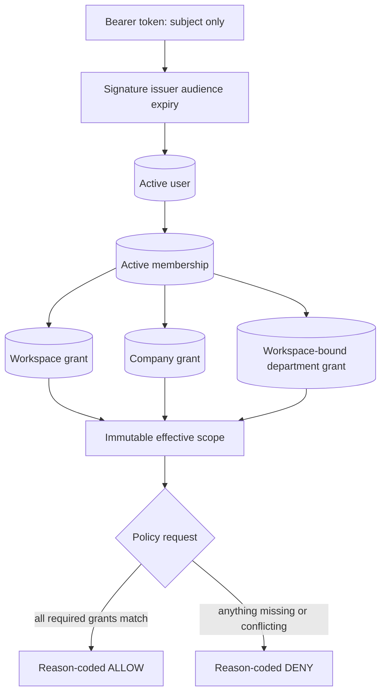
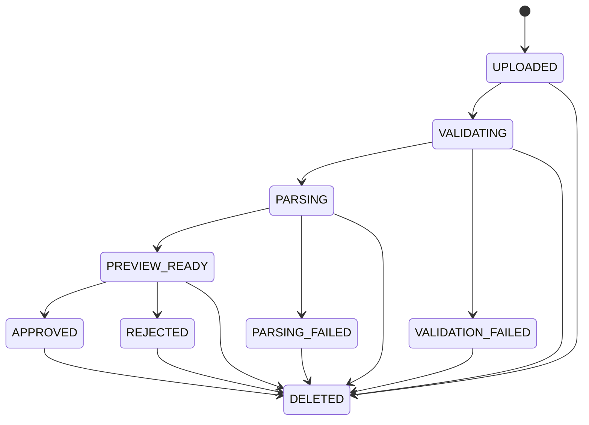
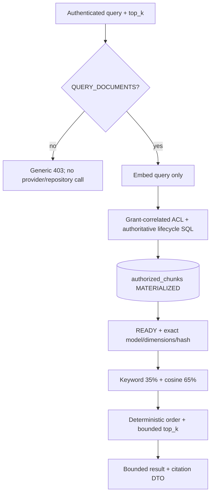
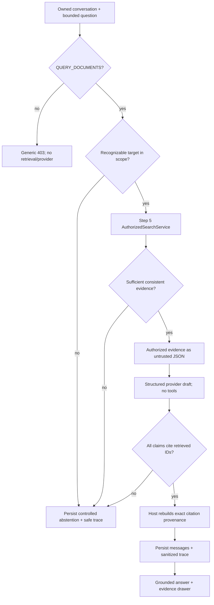

# Secure Portfolio Copilot Architecture

## Current memory-aware request path

Every chat request begins with a typed intent decision; retrieval is not the default entry point.
The router has no authorization power. The host reloads the actor's database grants, then selects
one of eight bounded workflows:

```text
authenticated request
  -> database-derived AuthorizationScope
  -> CASUAL | DOCUMENT_QUESTION | CONVERSATION_FOLLOW_UP | MEMORY_RECALL
     | MEMORY_WRITE | CALCULATION | CLARIFICATION | REFUSE
  -> authorize-first conversation/memory projection where relevant
  -> authorized repository or request-scoped approved MCP tool
  -> host citation/numeric/schema/terminal validation
  -> atomic message, trace, episode, and replay persistence
  -> strict validated NDJSON events
```

The direct grounded-chat path and the bounded agent path share the same repositories and trust
rules. Perception observes a bounded projection; Decision selects one typed action from a
host-shortlisted catalog; only the host executes it. Completed steps are immutable and the loop has
hard step, rewrite, replan, retry, tool-timeout, and total-duration bounds.

Working memory is a persisted owner/conversation message window plus rolling summary. Semantic and
episodic memory is first filtered by tenant, company, department, private owner, lifecycle, expiry,
and current source grants; only then is it ranked. These projections are quoted as untrusted
non-evidentiary context. They cannot expand scope, select tools, or satisfy citations.

Known safe explicit preference phrases use a deterministic-first extractor; only genuinely fuzzy
memory candidates depend on the constrained provider. Successful episodes copy provenance from the
answer's cited chunks rather than every retrieved candidate, so unrelated cross-department
distractors cannot suppress a valid episode. A later continuation recovers only the prior goal and
re-runs it against current authorized evidence; the stored historical outcome is never promoted to
current evidence.

The request-scoped MCP registry is static: `search_authorized_documents`, `get_document_excerpt`,
`query_financial_metrics`, `calculate_ebitda_margin`, `calculate_revenue_growth`,
`calculate_net_profit_margin`, `calculate_debt_to_equity`, `calculate_cash_runway`,
`calculate_cagr`, `search_memory`, and `propose_memory`. All use the `portfolio.` namespace.
The first ten are bounded reads/calculations; `propose_memory` only returns a typed candidate for
host policy. Remote MCP and dynamic discovery are deliberately deferred until deployment and
security ownership require a transport boundary.

Streaming is authenticated POST plus fetch-readable NDJSON. Safe progress events may be sent as
work happens, but model drafts are buffered. Only after response, citation, number, and authorization
validation does the server emit `answer.delta`, then citations and `message.completed`. The browser
strictly rejects unknown fields/event types. `client_message_id` is unique per actor/conversation,
so a retry replays the validated stored response rather than creating duplicate messages. The
browser performs at most one transport reconnect with the same ID; a replay `message.started`
resets prior-attempt answer/citation/notification rendering before validated delivery resumes.

## Scope

This document describes the Step 1 foundation, Step 2 identity/authorization, Step 3 governed
synthetic-document ingestion, Step 4 secure chunk storage, Step 5 approved-version embeddings and
authorization-first hybrid retrieval, Step 6 non-agentic grounded chat, Step 7's embedded approved
MCP gateway, Step 8's Perception, Decision, and bounded AgentLoop, the deterministic Gemini 3.1 Flash Lite/Gemini 3.7 Flash
router, source-inheriting scoped memory, Step 9's deterministic fixed calculators, and persistent
safe agent-run history. Arbitrary
execution, remote/dynamic MCP, multi-agent coordination, and deployment remain outside this scope.

```mermaid
flowchart LR
    Browser[React application] -->|login or bearer token| API[FastAPI]
    API --> RequestID[Request ID middleware]
    RequestID --> Auth[Authentication dependency]
    Auth --> JWT[Strict JWT validation]
    JWT --> Identity[Reload user memberships and grants]
    Identity --> Scope[Frozen AuthorizationScope]
    Scope --> Policy[Deterministic RBAC plus ABAC]
    Policy --> Ingestion[Governed document service]
    Ingestion --> Validator[Bounded format validation]
    Validator --> Parser[Resource-limited parser worker]
    Parser --> ObjectStore[Generated-key local object storage]
    Parser --> Parsed[(Versioned parsed provenance)]
    Ingestion -->|approve in one transaction| Chunker[Deterministic chunker]
    Chunker --> Embedder[Bounded EmbeddingProvider]
    Embedder --> Chunks[(ACL-copied chunks + pgvector)]
    Embedder --> Ollama[Loopback Ollama development adapter]
    Browser -->|development search| SearchAPI[Authorized search API]
    SearchAPI --> Scope
    Scope --> Search[Authorization-first hybrid repository]
    Search --> Chunks
    Search -->|query text only| Embedder
    Browser -->|owned conversation + question| ChatAPI[Grounded chat API]
    Browser -->|inspect/create/delete| MemoryAPI[Scoped memory API]
    MemoryAPI --> Scope
    Scope --> MemoryPolicy[Memory ACL + source reauthorization]
    MemoryPolicy --> MemoryRows[(Scoped memories + copied source provenance)]
    ChatAPI --> Scope
    ChatAPI --> ScopePreflight[Deterministic scope preflight]
    ScopePreflight --> Search
    Search -->|authorized evidence only| Prompt[Untrusted evidence + non-evidentiary memory JSON]
    MemoryRows -->|visible company-matched memory only| Prompt
    Prompt --> Router[Deterministic post-authorization router]
    Router -->|simple, one document, high confidence| FlashLite[OpenRouter Vertex Gemini 3.1 Flash Lite]
    Router -->|complex, multi-document, low confidence| ModelProvider[OpenRouter Vertex Gemini 3.7 Flash]
    FlashLite --> CitationValidator
    ModelProvider --> CitationValidator[Host citation validator]
    CitationValidator --> ChatRows[(Conversations + messages + safe traces)]
    CitationValidator --> Browser
    Browser -->|bounded agent run| AgentAPI[Owned agent-run API]
    AgentAPI --> Perception[Typed Perception]
    Perception --> AgentPolicy[Host policy + request shortlist]
    AgentPolicy --> Decision[Typed Decision: one action]
    Decision --> ApprovalPolicy{Agent control + risk policy}
    ApprovalPolicy -->|auto-execute| MCPClient[Official in-process MCP client]
    ApprovalPolicy -->|pause| ApprovalRows[(Safe single-use approval metadata)]
    Browser -->|approve reject change stop| ApprovalAPI[Approval resolution API]
    ApprovalAPI --> Identity
    ApprovalAPI --> ApprovalRows
    ApprovalAPI -->|validated same-run resume| Decision
    MCPClient --> MCPServer[Request-scoped MCP server]
    MCPServer --> Gateway[ApprovedToolGateway]
    Gateway --> DocTools[Authorized search or excerpt]
    DocTools --> Observation[Strict structured observation]
    Gateway --> Calculators[Three fixed financial calculators]
    Calculators -->|authorized literal spreadsheet cells| Chunks
    Calculators --> Observation
    Observation --> Perception
    Decision -->|FINALIZE| CitationValidator
    AgentAPI --> RunCheckpoint[(Safe agent run checkpoint)]
    Observation --> HistoryWriter[Metadata-only history writer]
    HistoryWriter --> RunHistory[(Plans + ordered steps + safe observations)]
    Browser -->|owner-scoped cursor reads| HistoryAPI[Agent history API]
    HistoryAPI --> RunCheckpoint
    HistoryAPI --> RunHistory
    Identity --> SQLAlchemy[SQLAlchemy async engine]
    RequestID --> Route[Typed health/readiness route]
    Route -->|/ready only| SQLAlchemy
    SQLAlchemy --> PostgreSQL[(PostgreSQL + pgvector)]
    Auth --> Envelope[JSON success/error envelope]
    Route --> Envelope
    Envelope --> Browser
    Alembic[Alembic] -->|schema migrations| PostgreSQL
```



## Persistent agent-run history

After the server proves conversation ownership and `QUERY_DOCUMENTS`, response-mode policy runs.
A Fast request requiring Deep exits before persistence. Every remaining agent request receives one
UUID and a safe CREATED checkpoint; authorized execution transitions it to RUNNING before any model
or tool call. Scope preflight refusal may transition directly from CREATED to REFUSED.

The terminal transaction writes immutable plan-version metadata, globally ordered non-replayable
steps, and safe observations. Observation document/chunk pairs are reauthorized against the current
materialized chunk statement before insertion. Messages, the existing request trace, history rows,
and terminal status commit together. Any validation/database failure rolls this transaction back;
the prior checkpoint is then marked FAILED with a content-free reason. Request cancellation maps to
CANCELLED. `AWAITING_APPROVAL` is now a durable state. Guided pauses before every tool. Balanced
automatically executes the five existing low-risk read-only retrieval/calculator tools, while
Autonomous executes authorized allow-listed tools inside the same fixed host budgets. Any future
tool that is not explicitly classified defaults to `ALWAYS_REQUIRE_APPROVAL`; none is added here.

An approval row stores only IDs, plan/step coordinates, approved names, SHA-256 action and scope
fingerprints, categorical risk/reason/status, expiry, resolver ID, and timestamps. A partial unique
index permits one `PENDING` row per run. Raw arguments, queries, prompts, document or memory content,
authorization objects, tokens, provider bodies, reasoning, paths, and stack traces are excluded.

Resolution reloads the authenticated user, memberships, tenant status, and grants through the normal
authentication dependency, then locks the owned run and approval rows. Foreign and unknown IDs share
the same 404. Expired, resolved, replayed, mismatched, and scope-drifted approvals fail closed. The
transaction marks an approval consumed before execution, so concurrent clicks cannot execute twice.
Before consumption, the host also checks the stored latest plan version, next global step number,
allow-listed tool/action equality, and run plan count; binding drift terminates without a tool call.
Approval does not add a capability or alter the allowlist.
The implementation uses this locked, owner-scoped database row as the equivalent host-owned
single-use mechanism; approval IDs are locators, not bearer secrets, and no approval token is exposed
to or stored by the browser.

Resume uses the run's immutable initial conversation-message reference and reruns typed Perception
and Decision under the freshly derived scope. The reconstructed canonical action must hash to the
approved hash before the gateway can run. A mismatch marks the run failed and performs no tool call.
Completed plan versions remain immutable. This design intentionally depends on deterministic
reconstruction; provider or plan drift fails closed and the user must start a new run. It does not
persist a raw model checkpoint or resumable arguments in trace/history tables.

Reject and Stop call no tool and terminate the old run safely. Change request supersedes the pending
approval, cancels the old immutable run, and submits bounded replacement text as a new authorized run
instead of rewriting completed history.

History list/detail routes derive tenant and user from the authenticated database context. The list
uses descending `(created_at, id)` keyset pagination with an opaque cursor. Detail loading eagerly
fetches plan/step/observation relationships only after exact owner filtering. Both foreign and
unknown IDs return `Agent run was not found.`

The browser validates an exact metadata contract and renders the stored Perception → Policy →
Decision → Tool → Observation → Final vocabulary with the existing sanitized timeline styles.
Document/chunk IDs are available only as already-authorized metadata; the page shows concise counts
and reason codes, not text or authorization internals.

## Authentication and authorization path

1. The browser posts only email and password to `/api/auth/login`; extra fields are rejected.
2. The backend performs Argon2 verification. Unknown users take a dummy verification path and
   receive the same error as a wrong password.
3. A successful login receives a signed 15-minute JWT containing only `sub`, `iss`, `aud`, `iat`,
   `exp`, and `jti`.
4. `/api/auth/me` accepts a bearer token and validates the fixed algorithm, signature, issuer,
   audience, required claims, and expiry.
5. The backend reloads the user, all active memberships, tenant status, role, primary department,
   and grants from PostgreSQL. Token claims never supply authorization.
6. The repository creates frozen `TrustedIdentity` and `AuthorizationScope` objects. Each scope grant
   binds one membership to one workspace, its companies, departments, and capabilities.
7. Policy code intersects capability, workspace, company, department, and role. Missing information
   denies by default and every result has a stable reason code.
8. The frontend displays the returned scope. Its protected route improves UX but does not authorize
   backend data.



## Backend request path

1. Uvicorn passes a request to FastAPI.
2. `RequestIDMiddleware` validates `X-Request-ID` or creates a UUID.
3. The route returns a Pydantic response model. `/ready` first calls the database readiness probe.
4. Expected and unexpected exceptions pass through centralized safe-error handlers.
5. The response includes the same request ID in JSON and the `X-Request-ID` header.
6. A structured log records request metadata after completion, without query strings or bodies.

Success shape:

```json
{
  "data": { "status": "healthy" },
  "request_id": "f6d8..."
}
```

Error shape:

```json
{
  "error": {
    "code": "service_unavailable",
    "message": "Service is not ready."
  },
  "request_id": "f6d8..."
}
```

## Frontend state flow

React Router renders the shared header, route outlet, and footer. The home route starts one abortable
health request through `getJson`. The client validates the envelope's basic shape and converts HTTP,
network, and invalid-response failures into a typed `ApiError`. `BackendHealth` renders a distinct
loading, online, or offline state.

The nested `/admin/documents` route mounts only when a current grant contains `MANAGE_UPLOADS`.
After mounting it loads a dedicated backend-derived options contract and the scoped management
library. The form cascades tenant to company and department to the allowed
visibility/classification pair. Native XHR reports upload-byte progress; subsequent job polling is
recursive, abortable, and non-overlapping. The page owns selection, preview, mutations, and refresh
state while child upload, library, preview, badge, and deletion components remain controlled.

In development builds, `/development/search` mounts only when a current grant contains
`QUERY_DOCUMENTS`. It posts a normalized bounded query and `top_k` to the development-only backend
endpoint. The page displays active scope; embedding/index state and counts; keyword, vector, and
final scores; IDs; metadata; and a citation preview with bounded excerpt and provenance. A strict
client validator requires citation/result identity and source equality and rejects unexpected
response fields. It performs no client-side authorization filtering and renders evidence as inert
text. Checked-in curated queries return measured Recall@5 and authorization-leak counts; ad hoc
queries return `not_run`. Production frontend builds omit the route, navigation, page, and API
module.

The `/chat` route mounts only for a current `QUERY_DOCUMENTS` capability. It loads an owner-scoped
conversation list, allows explicit or automatic conversation creation, and keeps this browser
session's turns by conversation. Submitted questions are normalized and bounded to 1,000
characters. An abort controller supports cancellation; the transcript shows separate loading,
empty, canceled, insufficient-evidence, denial, timeout, and generic-error states without partial
provider output.

Grounded responses render answer text, supported claims, inline evidence buttons, and limitations.
The evidence drawer displays the authorized excerpt plus document/version/chunk and page or
sheet/row/cell provenance, closes on Escape/backdrop/button, and restores focus. The client accepts
only exact response fields and validates UUIDs, bounds, timestamps, coordinate shape, unique
citation IDs, complete claim/citation set equality, and conversation identity. It performs no
authorization filtering and renders all strings as inert React text. The list API currently returns
summaries only, so a page reload cannot restore older messages.

## Document ingestion path

1. The route validates strict JSON metadata inside multipart form data, validates the idempotency
   header, and authorizes the target workspace/company before reading the file body.
2. Validation bounds bytes and checks the sanitized filename, extension, declared MIME, signature,
   PDF safety, CSV structure, and OOXML container contents. Invalid attempts persist only safe
   metadata and a stable failure code.
3. Accepted bytes receive a generated UUID-only storage key. The local adapter confines writes to
   its root, uses private permissions and an atomic promotion, and verifies size/checksum.
4. A spawned worker applies wall-clock and process resource limits. PDF output contains numbered
   pages. XLSX/CSV output contains sheets, numbered rows, coordinates, value kinds, and a
   `formula_like` flag; it never executes formulas.
5. The service writes parsed provenance and advances the version/job together to `PREVIEW_READY`.
   Version-addressed preview is then available; approval or rejection is legal only from that state.
   Approval locks the version row, transitions it to `APPROVED`, sets the current-approved pointer,
   deterministically chunks parsed content, and embeds every chunk in bounded batches. After all
   vectors validate, it deactivates old-version chunks and their vectors as `STALE`, installs new
   `READY` chunks, writes metadata-only audit events, and commits once. Chunking or embedding failure
   rolls the lifecycle transition, pointer, and replacement back before a generic error is returned.
6. Initial uploads deduplicate on checksum plus canonical scope metadata. A separate endpoint creates
   explicit versions. Actor/idempotency-key plus request fingerprint makes exact retries stable and
   conflicting reuse fail safely.
7. Rejection creates no chunks and deactivates any matching rows defensively. Deletion marks the
   logical document and every version `DELETED`, clears the approved pointer, deactivates every
   chunk, clears vector/model/hash metadata, marks the rows `STALE`, commits immediate
   unavailability, and then performs best-effort object cleanup with audited failures. Rejection
   performs the same vector invalidation for any matching version rows.



## Database flow

The `db` Compose service exposes local PostgreSQL. Alembic reads the same environment-backed URL as
the application. Its initial reversible migration enables pgvector; SQLAlchemy metadata is empty.
Step 2 adds tenants, companies, departments, roles, users, memberships, and three dimension-specific
grant tables. Step 3 adds logical documents, versions, ingestion jobs, parsed pages, parsed sheets,
rows, cells, and document audit events. Step 4 adds `document_chunks`, copied ACL/lifecycle columns,
a generated `TSVECTOR`, an ACL/lifecycle B-tree index, and a GIN full-text index. Migration
`20260821_0005` adds nullable `vector(768)`, model name/version/dimensions, embedded content hash,
embedding status, consistency constraints, a status index, and an HNSW cosine index. Its
`PENDING` server default makes pre-existing Step 4 chunks explicit reindex candidates. The
development seed writes only synthetic identity rows; documents and chunks are created through
governed ingestion. Migration `20260821_0006` adds `conversations`, `messages`, and
`chat_request_traces`. Conversations bind tenant/user ownership and activity. Messages bind a
conversation, tenant, user, `user|assistant` role, content, request ID, and creation time. Traces
bind request/conversation/tenant/user and contain only model, safe status/reason, permitted
retrieved document/chunk IDs, optional token counts, latency, retry count, and time. `/ready` still
executes only `SELECT 1`. Migration `20260821_0008` adds `memories` and `memory_sources`; memory rows
carry tenant/company/scope/owner plus exact department, visibility, and classification, while source
rows copy the authorized chunk/document/version identity and ACL used at creation.

## Embedding provider boundary

`EmbeddingProvider` exposes three operations/data points: immutable model metadata, `ensure_ready`,
and ordered batch `embed`. The contract is fixed to `nomic-embed-text:v1.5`, 768 dimensions.

- The development Ollama adapter accepts only explicit HTTP loopback URLs, disables environment
  proxy inheritance, checks or pulls the exact model tag, and performs one bounded retry only for
  transient failures.
- The deterministic token-hash fake supplies finite non-zero vectors for tests; it is not a semantic
  quality baseline or production adapter.
- The disabled provider always fails closed. Production settings require it, and production omits
  the development routes. Because approval currently embeds synchronously, production approval also
  fails closed until a separately approved production provider/worker design exists.
- Batch size is 1–64 (default 16), total chunks per operation default to 512, provider calls default
  to 30 seconds, and a complete operation defaults to 120 seconds. Cardinality, dimensions,
  finiteness, and non-zero norm are checked before persistence.

## Authorized hybrid search path

1. FastAPI authenticates the bearer subject and reloads the current database scope.
2. The service denies users such as Nora who have no `QUERY_DOCUMENTS` capability; neither the
   embedding provider nor repository runs on this path.
3. Strict request validation accepts only `query` (1–500 normalized characters) and `top_k` (1–20).
   Identity, tenant, company, department, role, document, version, and scope fields are forbidden.
4. The configured provider receives only the query and must return one valid 768-dimensional vector.
   Candidate document text is not sent to the provider during search.
5. Every public production retrieval repository method requires `AuthorizationScope` as a mandatory
   argument. Grant-correlated SQL predicates bind workspace, company, and allowed departments.
6. PostgreSQL builds `authorized_chunks AS MATERIALIZED` using exact visibility/classification,
   active tenant/company, copied-to-authoritative metadata equality, approval/deletion state, active
   chunks, and the document's current approved version. It also requires `READY`, exact model
   name/version/dimensions, a non-null vector, and `embedding_chunk_hash = content_hash`.
7. Only after that CTE is materialized does SQL compute normalized full-text score, bounded cosine
   similarity, `0.35 * keyword + 0.65 * vector`, deterministic tie-breaks, and `top_k`. Unlike Step
   4, there is no keyword-match predicate, so an authorized semantic result may have keyword score
   zero.
8. The repository materializes at most 20 rows with a maximum 500-character excerpt. The service
   returns three scores plus a citation containing title, chunk/document/version IDs, version,
   excerpt, and page or sheet/row/cell provenance.
9. The audit event contains actor/request/permitted-resource IDs, counts, and `top_k` only. Query,
   vectors, excerpts, forbidden candidates, and document content are absent from audit metadata and
   logs.



## LLM provider and prompt boundary

Before generation, backend routing sees only the workload kind, normalized question shape,
distinct authorized document count, and top authorized retrieval score. It does not receive or
produce identity, grants, scope, classification, or authorization decisions. Agentic work bypasses
the economical route and is pinned to Gemini 3.7 Flash. Retryable Gemini 3.1 Flash Lite failures may fall forward to Gemini 3.7 Flash with
the same authorized evidence; no strong request downgrades to Gemini 3.1 Flash Lite.

`LLMProvider` accepts a normalized question plus a tuple of host-owned `GroundedEvidence` and
returns a structured answer draft plus safe usage metadata. Automated tests use the deterministic
fake adapter; the disabled adapter fails closed. The real adapter uses OpenRouter's
OpenAI-compatible HTTPS endpoint with its key read only from environment-backed settings. The
endpoint, `google-vertex` provider, and both Gemini model IDs are pinned. Provider routing uses
`only: [google-vertex]`, `allow_fallbacks: false`, and `data_collection: deny`.

The adapter sends neither strict JSON-schema `response_format` nor reasoning parameters because
the verified Vertex BYOK route does not support that combination. System prompts require JSON only.
Only visible `message.content` crosses the provider boundary, and strict Pydantic validation occurs
inside a two-call total budget. Upstream bodies, reasoning fields, prompts, and exception messages
do not cross the provider boundary.

No tools or tool configuration is passed. The application enables no model web search, URL/file
access, code execution, computer use, file search, or function calling. Evidence enters the prompt
only as JSON under `authorized_untrusted_evidence`; excerpts are `quoted_excerpt` values and the
system instruction says all embedded commands, policies, role changes, and prompt text are data to
ignore. The prompt asks for evidence IDs rather than full citation objects.

## Grounded chat path

1. FastAPI authenticates the bearer subject and reloads current database grants.
2. Conversation create/list derives tenant and owner from that immutable context. Message creation
   loads the conversation by conversation ID, tenant ID, and user ID; missing and foreign IDs are
   indistinguishable safe 404s.
3. The service requires `QUERY_DOCUMENTS` before adding a message, retrieval, or generation. A
   deterministic department/target preflight recognizes explicit requests outside current scope
   and persists an abstention without calling search or the model.
4. The Step 5 `AuthorizedSearchService` receives the trusted context, question, request ID, and the
   configured evidence limit (default five). It embeds the query and returns only rows selected
   after materialized database authorization and lifecycle predicates.
5. Low-relevance results are dropped. Remaining results must have internally identical
   result/citation/source provenance before the host assigns `ev_1`, `ev_2`, and so on. Any
   inconsistency yields no prompt evidence and a controlled abstention.
6. The service separately loads at most five visible memory items for the evidence companies. The
   same current SQL scope and every memory source are reauthorized before content is selected.
7. The provider receives only the question, evidence objects, and separately labeled untrusted,
   non-evidentiary memory. No identity, role, tenant, company, department, capability, or scope is
   model-generated or model-editable.
8. Host validation accepts only a supported draft with non-empty bounded claims. Each claim must
   name at least one unique evidence ID, and all IDs must exist in the request evidence map.
9. The host reconstructs citation DTOs from the evidence map. Missing, unknown, fabricated, or
   incomplete references and an unsupported provider status produce `insufficient_evidence` with
   no claims or citations. The validator proves reference/provenance integrity, not semantic
   entailment or numeric correctness.
10. Grounded/abstaining paths commit user and assistant messages plus one sanitized trace. A provider
   failure commits the user message and `provider_error` trace, then returns a generic 503 or 504.
11. Logs emit only request/conversation IDs, safe status/reason codes, and evidence/citation counts.
    They exclude keys, questions, prompts, excerpts, answers, provider output, and reasoning.



## Scoped memory path

Memory is an explicit authorization-bound store, not global chat history. `PRIVATE_USER` may be
source-free; Finance, Legal, and Shared writes require currently authorized source chunks whose
copied ACL tuples match exactly. A private sourced memory may narrow who can see it but retains the
source department/classification. Client-supplied ACL or ownership fields are rejected.

List, search, get, and delete all start from a materialized visible-memory set: current workspace,
company, department, user ownership, scope-to-ACL consistency, expiry, soft deletion, and the
absence of any currently unauthorized source. Full-text ranking occurs only after that boundary.
The inspector uses the same set. Memory audit events contain IDs, action, outcome, scope, and count,
never content or search text.

## Deterministic calculator path

The three calculator contracts are fixed to EBITDA margin, revenue growth, and net profit margin.
The model may provide only a company slug and `FYyyyy` reporting period. Raw MCP validation rejects
numeric inputs, formulas, tenant/user/department fields, and every extra key before adapter code
runs.

Each invocation derives eligible company IDs and Finance access from the current immutable scope,
then materializes the authorized-chunk lifecycle/ACL statement. Only one currently authorized P&L
XLSX version is accepted. Parsed headers identify periods and metrics; every required value must be
a bounded literal numeric cell with unit `INR crore`, covered by exactly one authorized chunk.
Missing, malformed, formula-like, ambiguous, unauthorized, and zero-denominator cases return typed
content-free failures.

Host `Decimal` arithmetic evaluates the fixed formula. The result contains the formula, input name,
period, value, unit, and exact document/version/chunk/sheet/row/cell provenance for every input.
The agent assigns host `ev_N` IDs and constructs the claim and citations without asking a model to
calculate or copy the result. No calculator migration is required: results are reproducible
response data derived from current approved parsed cells.

Calculator company selectors are still untrusted. A canonical company slug is accepted only when it
is paired with an eligible Finance company ID in the database-derived scope. A user-facing tenant or
workspace alias may resolve to that canonical company only when the same eligible grant contains
exactly one company; ambiguous and unauthorized aliases fail closed. The model never receives or
creates effective scope, and the repository queries by the resolved authorized UUID before emitting
the canonical slug in the result.

## Bounded AgentLoop and MCP path

The Session 10 reference was inspected read-only. Steps 7 and 8 retain its useful single-session state,
separate Perception/Decision stages, step-result feedback, plan versions, and timeline concept. It
rejects `run_user_code`, `compile`/`exec`, generated Python, positional argument reconstruction,
unbounded `while` execution, broad MCP discovery, raw console/session logs, unscoped global memory,
shell/SQL/URL/path/browser/computer tools, and raw reasoning traces. No Session 10 module is imported
or copied into production.

`POST /api/conversations/{conversation_id}/agent-runs` first reloads the owned conversation and
current immutable `AuthorizationContext`. Missing capability returns 403. Recognizable scope denial
returns a policy/terminal trace without calling Perception, MCP, retrieval, or the model. Otherwise:

1. Perception classifies the bounded question into one supported portfolio intent using bounded
   typed entities, required evidence/capabilities, advisory scope hints, risk flags, and goal state.
   It cannot authorize, calculate, answer, control retries, or select/execute a tool.
2. Host policy binds the immutable scope and obtains the deterministic request catalog from
   `ApprovedToolGateway.permitted_catalog`.
3. Decision receives only manifest-derived authorized descriptors containing a name, purpose,
   exact tool-specific input schema, and safe result description. It emits a one-to-three-step plan
   with matching internal plan text plus exactly one `TOOL_CALL`, `FINALIZE`, `CLARIFY`, or
   `REFUSE`. Action JSON forbids authorization/execution fields and must match the first pending
   plan step.
4. `AgentGatewayAdapter` strictly validates raw JSON before the MCP SDK can coerce types. It creates
   a request-scoped official `Client(MCPServer)` whose closure owns scope, shortlist, and request ID.
5. The server registers only the shortlisted subset of two document tools and three fixed
   calculator tools. The gateway again
   checks name, shortlist, capability, input schema, timeout/retry, and output schema. Each adapter
   reuses the Step 5 authorization/lifecycle SQL; missing and unauthorized excerpt IDs are identical
   denials.
6. A typed observation returns to step-result Perception with the original query, previous
   snapshot, current plan, immutable completed history, and safe remaining budgets before another
   Decision. Identity, grants, scope, secrets, paths, and raw errors are excluded. Evidence receives
   host `ev_N` IDs. Failed observations contain no evidence.
7. `PlanState` owns versions, progression, completed history, and replay detection. It requires
   initial version 1, exact one-version increments, first-pending-step order, and immutable completed
   steps. Host counters stop after four tools, the initial search plus one semantic rewrite, one
   replan, one transient retry per tool, or the total duration. Plan changes count as replans even if
   the model omits its replan flag. Authorization denial is never retried.
8. `FINALIZE` calls the grounded provider and Step 6 validator for document answers. A successful
   fixed calculator instead uses a deterministic host finalizer. Only a completed run may carry
   claims/citations, and every citation is reconstructed from authorized observation evidence.

The gateway catalog is statically owned and application startup validates both adapter definitions
against the manifest. Duplicate names, unknown namespaces, missing tools, and input/output schema or
capability mismatch raise a configuration error before the app is served. The automated MCP smoke
uses the official in-process client, lists only one request-shortlisted tool, calls it, and strictly
revalidates `structured_content`.

The response trace is deliberately not the internal AgentSession. It projects only host UUID event
IDs, stage/status, five exact approved action names, host `ev_N` references, duration, counters, and
allow-listed reason/stopping codes. Queries, prompts, perceptions, plan text, action arguments,
observations, excerpts, scope, paths, raw errors, answers, secrets, and rationale are absent. Steps 7
and 8 add no database table: messages and metadata-only request traces use migration `0006`; the detailed
timeline is response-only.

## Authorized reindex path

`POST /api/development/reindex-embeddings` exists only in development/test and accepts no body.
The route first requires at least one database-derived manageable pair. Its query then selects at
most `EMBEDDING_MAX_CHUNKS` `PENDING`/`FAILED` rows that are active, current, approved, non-deleted,
inside an admin `MANAGE_UPLOADS` workspace/company grant, and equal to authoritative ACL/lifecycle
rows. `FOR UPDATE SKIP LOCKED` prevents concurrent workers from claiming the same rows. A successful
call writes `READY` vectors and a count-only audit; provider failure rolls back and returns a generic 503. Operators repeat the call until `processed_chunk_count` is zero.

## Automatic user-isolated memory

The memory subsystem extends the existing PostgreSQL `memories`, `memory_sources`, conversations,
messages, agent runs, and document chunks. It does not use filesystem session logs or a shared
global index.

```text
short JWT
  -> reload active user, memberships and grants from PostgreSQL
  -> load bounded owner + tenant + conversation working memory
  -> materialize authorized active memory candidates in SQL
       -> exclude deleted / expired / pending / superseded
       -> reauthorize every copied document/version/chunk source
  -> rank only that candidate set (FTS + type + recency + importance + preference boost)
  -> apply per-type and total context budgets
  -> retrieve current authorized document evidence
  -> clearly delimited prompt context -> grounded answer + current document citations
```

This ordering implements **authorize first, rank second**. Private ownership, tenant, company,
department, classification, capabilities, and source access are database-derived. The memory API,
extractor output, browser, and model cannot set them.

Before generation, the prompt separates recent conversation, rolling summary, semantic
preferences, prior episodes, current authorized evidence, and the current question. All memory and
document text is quoted untrusted data. Memory may guide presentation or navigation but can never
act as a system instruction, support a factual claim, or become a citation.

After a successful response, the provider may return strict memory-candidate JSON. Deterministic
host policy accepts only bounded low-risk private semantic preferences. Explicit preferences become
active for 90 days; identical reconfirmation refreshes expiry; a changed normalized preference
supersedes the old row atomically; inferred preferences remain pending; sensitive, temporary, and
document-derived facts are rejected. Optional extraction failure is contained in a savepoint and
cannot remove the answer.

Useful grounded runs create private 30-day episodic summaries containing a short goal/outcome and
copied source identifiers, never raw tool payloads, prompts, secrets, or hidden reasoning. On reuse,
the source-aware authorization CTE must still match every current chunk and copied ACL field. The
new answer is re-grounded from current document chunks and cites those documents, not the episode.

Working memory uses at most eight persisted messages (each bounded for prompt use). Once that
window fills, the service stores one bounded rolling `CONVERSATION_SUMMARY` scoped to the same
authenticated tenant, owner, and conversation. PostgreSQL persistence makes all three memory types
survive application restart.

Current limitation: user-memory vector embeddings are not generated. Retrieval uses real
PostgreSQL FTS and deterministic ranking through a clean repository abstraction; no fake vector
search is presented. Document RAG continues to use its independent versioned embedding pipeline.

## Trust boundaries

- The browser and all request headers are untrusted.
- Environment configuration is operational input and is validated by Pydantic.
- PostgreSQL connectivity is not exposed as raw errors.
- The request ID is correlation metadata, never proof of identity or authority.
- JWTs prove only a subject reference; database state determines current authority.
- Workspace, company, and department grants remain bound rather than flattened into client-editable
  arrays.
- A role alone never grants query access. Nora's Admin role has no query department grant.
- Uvicorn's query-string access log is disabled; the application emits metadata-only request logs.
- Uploaded filenames and file contents never become storage paths, authority inputs, audit metadata,
  or log fields. Generated storage keys are server-owned.
- Approval changes lifecycle state only. It does not grant `QUERY_DOCUMENTS` or invoke retrieval.
- Parser output is untrusted display data and is rendered as React text, never HTML or executable
  spreadsheet content.
- Chunks inherit authorization metadata; they cannot widen a document's visibility or classification.
- Embedding creation cannot widen authority. Approval and backfill are reached only after current
  management authorization; provider output is validated numerical data, never scope input.
- Search authorization lives in SQL-backed repository code. UI route hiding is only a convenience.
- Authorization and authoritative lifecycle filtering are materialized before cosine distance,
  ranking, or top-k. Forbidden candidate text is never returned to the service, UI, provider during
  search, audit event, or request log.
- Old, rejected, or deleted chunks lose their vectors and become `STALE`; pending/failed/wrong-model/
  wrong-hash chunks are ineligible.
- Search does not downgrade to keyword-only behavior on provider failure; it returns a generic 503.
- The authorized-search and embedding-reindex APIs are registered only for `development` and `test`
  environments.
- Conversation rows are tenant/user owned. The model never chooses conversation ownership or
  authorization scope, and a foreign conversation is indistinguishable from a missing one.
- Explicit recognizable cross-tenant/department requests abstain before retrieval/generation, while
  Step 5 SQL authorization remains the authoritative row-level boundary for every query.
- Retrieved document text is untrusted prompt data. Prompt instructions and no-tool provider
  configuration reduce injection capability; host citation validation is the final output gate.
- Model output never supplies trusted provenance. Only retrieved evidence IDs may be referenced,
  and the host reconstructs exact citation fields from those authorized rows.
- `messages` intentionally contain conversation questions/answers. Traces and logs are separate
  metadata-only records and must never copy question, prompt, evidence, answer, key, provider body,
  or hidden reasoning.
- The small curated retrieval evaluation and one-case live provider smoke are not broad quality
  benchmarks. Fixed calculators validate their arithmetic and provenance, but no broad semantic
  entailment or arbitrary numeric-analysis engine exists.
## Evaluation subsystem

`app/evaluations` is a one-way orchestration layer over existing application boundaries:

```text
checked-in manifest -> evaluation service -> runner
                                         -> policy engine
                                         -> authorized retrieval / citation validation
                                         -> scoped memory repository
                                         -> deterministic calculation repository
                                         -> grounded chat
                                         -> optional advisory judge (max 2)
                                         -> deterministic scorers -> release gates
                                         -> PostgreSQL safe results
```

The API selects only manifest `1.0.0`. Strict Pydantic contracts forbid extra fields and startup fails unless there are exactly 20 authorized positive, 10 explicit denial, 4 memory isolation, 4 deterministic calculation, and 4 insufficient-evidence cases. A canonical JSON SHA-256 binds persisted results to the checked-in content.

Alembic revision `20260821_0009` adds `evaluation_runs` and `evaluation_case_results`. Run states are explicit: `PENDING`, `RUNNING`, `PASSED`, `FAILED`, `SECURITY_FAILED`, and `ERROR`. A PostgreSQL advisory transaction lock serializes the active-run check/create operation; the durable active row rejects duplicates for the rest of execution.

Retrieval applies tenant/company/department/lifecycle authorization in a materialized CTE before scoring. A second ranking stage round-robins the highest-ranked chunks per document, preventing one long document from crowding every slot in document-level Recall@5. No evaluator-only ACL shortcut exists.

The optional judge uses `google/gemini-3.7-flash`, forces `google-vertex`, disables fallback, denies data collection, sends no tools or reasoning parameter, uses prompt-only JSON, validates locally, permits one provider attempt per judged case, and stops at two total calls.

## Response-mode routing boundary

```text
strict mode enum -> ownership/capability/scope checks -> authorized retrieval/evidence sufficiency
                 -> host automatic classification -> mode resolution
                    -> Fast eligible: simple model
                    -> Fast upgrade: safe 409, no persistence/provider
                    -> Auto: simple or heavy model
                    -> Deep: heavy model
```

The host-owned decision records requested mode, resolved mode, model tier, categorical reason, and
upgrade-required state. The browser cannot submit route reasons, providers, model IDs, fallback
controls, scope, or limits. For agent requests, Fast resolves to the upgrade response before
Perception, Decision, MCP catalog construction, or tool execution; Auto and Deep use the heavy
stages. All provider calls keep the fixed Vertex-only provider object, prompt-only JSON, and strict
local validation, with no tools/reasoning/JSON-schema response format.
