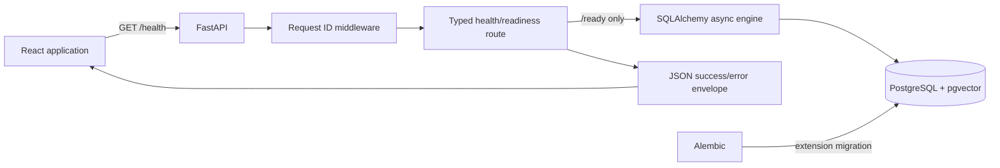

# Step 1 Architecture

## Scope

This document describes only Playbook Step 1 / PRD Milestone 0. The system is currently a development
harness, not a portfolio copilot workflow.



## Backend request path

1. Uvicorn passes a request to FastAPI.
2. `RequestIDMiddleware` validates `X-Request-ID` or creates a UUID.
3. The route returns a Pydantic response model. `/ready` first calls the database readiness probe.
4. Expected and unexpected exceptions pass through centralized safe-error handlers.
5. The response includes the same request ID in JSON and the `X-Request-ID` header.
6. A structured log records request metadata after completion, without query strings or bodies.

Success shape:

```json
{
  "data": { "status": "healthy" },
  "request_id": "f6d8..."
}
```

Error shape:

```json
{
  "error": {
    "code": "service_unavailable",
    "message": "Service is not ready."
  },
  "request_id": "f6d8..."
}
```

## Frontend state flow

React Router renders the shared header, route outlet, and footer. The home route starts one abortable
health request through `getJson`. The client validates the envelope's basic shape and converts HTTP,
network, and invalid-response failures into a typed `ApiError`. `BackendHealth` renders a distinct
loading, online, or offline state.

## Database flow

The `db` Compose service exposes local PostgreSQL. Alembic reads the same environment-backed URL as
the application. Its initial reversible migration enables pgvector; SQLAlchemy metadata is empty.
No product row is read or written. `/ready` executes only `SELECT 1`.

## Trust boundaries

- The browser and all request headers are untrusted.
- Environment configuration is operational input and is validated by Pydantic.
- PostgreSQL connectivity is not exposed as raw errors.
- The request ID is correlation metadata, never proof of identity or authority.
- There is no authenticated boundary or tenant scope in this milestone.
