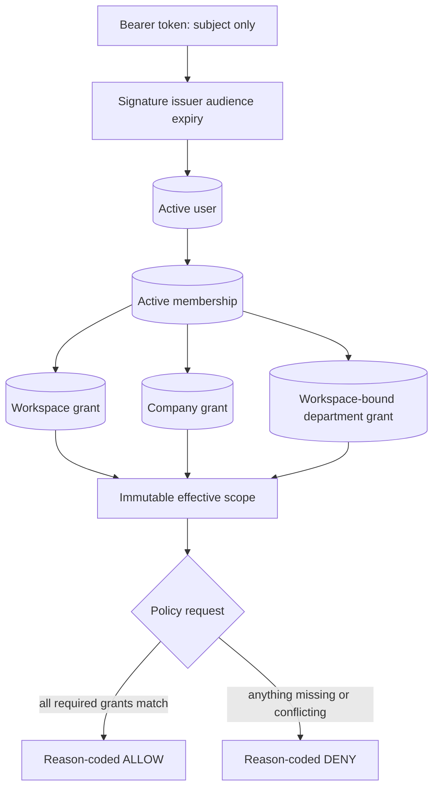
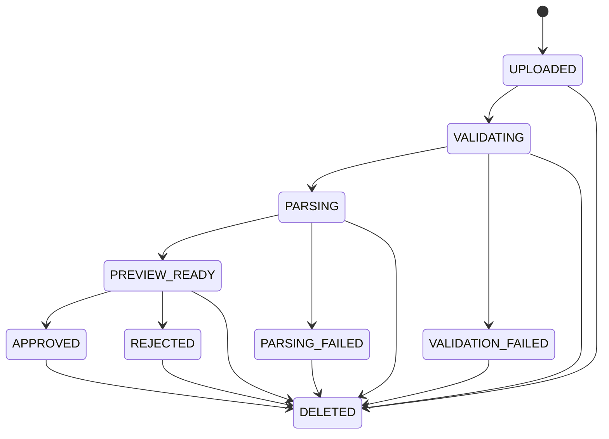
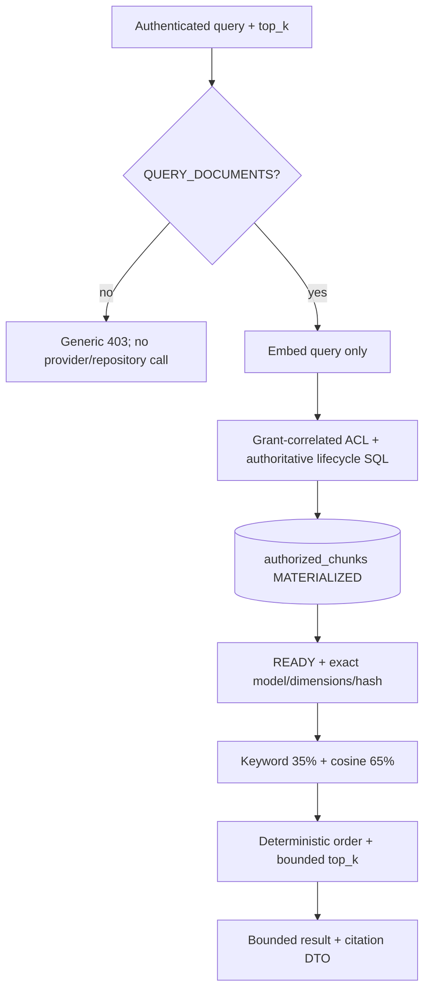
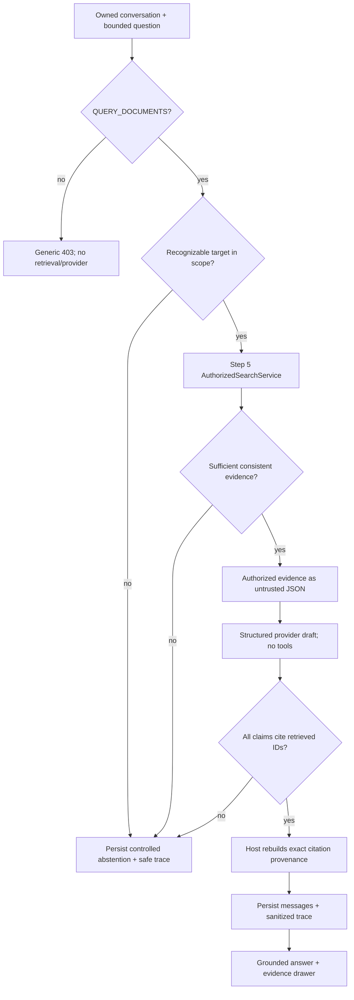

# Step 8 Architecture

## Scope

This document describes the Step 1 foundation, Step 2 identity/authorization, Step 3 governed
synthetic-document ingestion, Step 4 secure chunk storage, Step 5 approved-version embeddings and
authorization-first hybrid retrieval, Step 6 non-agentic grounded chat, Step 7's embedded approved
MCP gateway, and Step 8's Perception, Decision, and bounded AgentLoop. Memory, calculations,
arbitrary execution, remote/dynamic MCP, multi-agent coordination, and deployment remain outside
this scope.

```mermaid
flowchart LR
    Browser[React application] -->|login or bearer token| API[FastAPI]
    API --> RequestID[Request ID middleware]
    RequestID --> Auth[Authentication dependency]
    Auth --> JWT[Strict JWT validation]
    JWT --> Identity[Reload user memberships and grants]
    Identity --> Scope[Frozen AuthorizationScope]
    Scope --> Policy[Deterministic RBAC plus ABAC]
    Policy --> Ingestion[Governed document service]
    Ingestion --> Validator[Bounded format validation]
    Validator --> Parser[Resource-limited parser worker]
    Parser --> ObjectStore[Generated-key local object storage]
    Parser --> Parsed[(Versioned parsed provenance)]
    Ingestion -->|approve in one transaction| Chunker[Deterministic chunker]
    Chunker --> Embedder[Bounded EmbeddingProvider]
    Embedder --> Chunks[(ACL-copied chunks + pgvector)]
    Embedder --> Ollama[Loopback Ollama development adapter]
    Browser -->|development search| SearchAPI[Authorized search API]
    SearchAPI --> Scope
    Scope --> Search[Authorization-first hybrid repository]
    Search --> Chunks
    Search -->|query text only| Embedder
    Browser -->|owned conversation + question| ChatAPI[Grounded chat API]
    ChatAPI --> Scope
    ChatAPI --> ScopePreflight[Deterministic scope preflight]
    ScopePreflight --> Search
    Search -->|authorized evidence only| Prompt[Untrusted-evidence JSON prompt]
    Prompt --> ModelProvider[Gemini or Runpod Kimi adapter; no tools]
    ModelProvider --> CitationValidator[Host citation validator]
    CitationValidator --> ChatRows[(Conversations + messages + safe traces)]
    CitationValidator --> Browser
    Browser -->|bounded agent run| AgentAPI[Owned agent-run API]
    AgentAPI --> Perception[Typed Perception]
    Perception --> AgentPolicy[Host policy + request shortlist]
    AgentPolicy --> Decision[Typed Decision: one action]
    Decision --> MCPClient[Official in-process MCP client]
    MCPClient --> MCPServer[Request-scoped MCP server]
    MCPServer --> Gateway[ApprovedToolGateway]
    Gateway --> DocTools[Authorized search or excerpt]
    DocTools --> Observation[Strict structured observation]
    Observation --> Perception
    Decision -->|FINALIZE| CitationValidator
    Identity --> SQLAlchemy[SQLAlchemy async engine]
    RequestID --> Route[Typed health/readiness route]
    Route -->|/ready only| SQLAlchemy
    SQLAlchemy --> PostgreSQL[(PostgreSQL + pgvector)]
    Auth --> Envelope[JSON success/error envelope]
    Route --> Envelope
    Envelope --> Browser
    Alembic[Alembic] -->|schema migrations| PostgreSQL
```



## Authentication and authorization path

1. The browser posts only email and password to `/api/auth/login`; extra fields are rejected.
2. The backend performs Argon2 verification. Unknown users take a dummy verification path and
   receive the same error as a wrong password.
3. A successful login receives a signed 15-minute JWT containing only `sub`, `iss`, `aud`, `iat`,
   `exp`, and `jti`.
4. `/api/auth/me` accepts a bearer token and validates the fixed algorithm, signature, issuer,
   audience, required claims, and expiry.
5. The backend reloads the user, all active memberships, tenant status, role, primary department,
   and grants from PostgreSQL. Token claims never supply authorization.
6. The repository creates frozen `TrustedIdentity` and `AuthorizationScope` objects. Each scope grant
   binds one membership to one workspace, its companies, departments, and capabilities.
7. Policy code intersects capability, workspace, company, department, and role. Missing information
   denies by default and every result has a stable reason code.
8. The frontend displays the returned scope. Its protected route improves UX but does not authorize
   backend data.



## Backend request path

1. Uvicorn passes a request to FastAPI.
2. `RequestIDMiddleware` validates `X-Request-ID` or creates a UUID.
3. The route returns a Pydantic response model. `/ready` first calls the database readiness probe.
4. Expected and unexpected exceptions pass through centralized safe-error handlers.
5. The response includes the same request ID in JSON and the `X-Request-ID` header.
6. A structured log records request metadata after completion, without query strings or bodies.

Success shape:

```json
{
  "data": { "status": "healthy" },
  "request_id": "f6d8..."
}
```

Error shape:

```json
{
  "error": {
    "code": "service_unavailable",
    "message": "Service is not ready."
  },
  "request_id": "f6d8..."
}
```

## Frontend state flow

React Router renders the shared header, route outlet, and footer. The home route starts one abortable
health request through `getJson`. The client validates the envelope's basic shape and converts HTTP,
network, and invalid-response failures into a typed `ApiError`. `BackendHealth` renders a distinct
loading, online, or offline state.

The nested `/admin/documents` route mounts only when a current grant contains `MANAGE_UPLOADS`.
After mounting it loads a dedicated backend-derived options contract and the scoped management
library. The form cascades tenant to company and department to the allowed
visibility/classification pair. Native XHR reports upload-byte progress; subsequent job polling is
recursive, abortable, and non-overlapping. The page owns selection, preview, mutations, and refresh
state while child upload, library, preview, badge, and deletion components remain controlled.

In development builds, `/development/search` mounts only when a current grant contains
`QUERY_DOCUMENTS`. It posts a normalized bounded query and `top_k` to the development-only backend
endpoint. The page displays active scope; embedding/index state and counts; keyword, vector, and
final scores; IDs; metadata; and a citation preview with bounded excerpt and provenance. A strict
client validator requires citation/result identity and source equality and rejects unexpected
response fields. It performs no client-side authorization filtering and renders evidence as inert
text. Checked-in curated queries return measured Recall@5 and authorization-leak counts; ad hoc
queries return `not_run`. Production frontend builds omit the route, navigation, page, and API
module.

The `/chat` route mounts only for a current `QUERY_DOCUMENTS` capability. It loads an owner-scoped
conversation list, allows explicit or automatic conversation creation, and keeps this browser
session's turns by conversation. Submitted questions are normalized and bounded to 1,000
characters. An abort controller supports cancellation; the transcript shows separate loading,
empty, canceled, insufficient-evidence, denial, timeout, and generic-error states without partial
provider output.

Grounded responses render answer text, supported claims, inline evidence buttons, and limitations.
The evidence drawer displays the authorized excerpt plus document/version/chunk and page or
sheet/row/cell provenance, closes on Escape/backdrop/button, and restores focus. The client accepts
only exact response fields and validates UUIDs, bounds, timestamps, coordinate shape, unique
citation IDs, complete claim/citation set equality, and conversation identity. It performs no
authorization filtering and renders all strings as inert React text. The list API currently returns
summaries only, so a page reload cannot restore older messages.

## Document ingestion path

1. The route validates strict JSON metadata inside multipart form data, validates the idempotency
   header, and authorizes the target workspace/company before reading the file body.
2. Validation bounds bytes and checks the sanitized filename, extension, declared MIME, signature,
   PDF safety, CSV structure, and OOXML container contents. Invalid attempts persist only safe
   metadata and a stable failure code.
3. Accepted bytes receive a generated UUID-only storage key. The local adapter confines writes to
   its root, uses private permissions and an atomic promotion, and verifies size/checksum.
4. A spawned worker applies wall-clock and process resource limits. PDF output contains numbered
   pages. XLSX/CSV output contains sheets, numbered rows, coordinates, value kinds, and a
   `formula_like` flag; it never executes formulas.
5. The service writes parsed provenance and advances the version/job together to `PREVIEW_READY`.
   Version-addressed preview is then available; approval or rejection is legal only from that state.
   Approval locks the version row, transitions it to `APPROVED`, sets the current-approved pointer,
   deterministically chunks parsed content, and embeds every chunk in bounded batches. After all
   vectors validate, it deactivates old-version chunks and their vectors as `STALE`, installs new
   `READY` chunks, writes metadata-only audit events, and commits once. Chunking or embedding failure
   rolls the lifecycle transition, pointer, and replacement back before a generic error is returned.
6. Initial uploads deduplicate on checksum plus canonical scope metadata. A separate endpoint creates
   explicit versions. Actor/idempotency-key plus request fingerprint makes exact retries stable and
   conflicting reuse fail safely.
7. Rejection creates no chunks and deactivates any matching rows defensively. Deletion marks the
   logical document and every version `DELETED`, clears the approved pointer, deactivates every
   chunk, clears vector/model/hash metadata, marks the rows `STALE`, commits immediate
   unavailability, and then performs best-effort object cleanup with audited failures. Rejection
   performs the same vector invalidation for any matching version rows.



## Database flow

The `db` Compose service exposes local PostgreSQL. Alembic reads the same environment-backed URL as
the application. Its initial reversible migration enables pgvector; SQLAlchemy metadata is empty.
Step 2 adds tenants, companies, departments, roles, users, memberships, and three dimension-specific
grant tables. Step 3 adds logical documents, versions, ingestion jobs, parsed pages, parsed sheets,
rows, cells, and document audit events. Step 4 adds `document_chunks`, copied ACL/lifecycle columns,
a generated `TSVECTOR`, an ACL/lifecycle B-tree index, and a GIN full-text index. Migration
`20260821_0005` adds nullable `vector(768)`, model name/version/dimensions, embedded content hash,
embedding status, consistency constraints, a status index, and an HNSW cosine index. Its
`PENDING` server default makes pre-existing Step 4 chunks explicit reindex candidates. The
development seed writes only synthetic identity rows; documents and chunks are created through
governed ingestion. Migration `20260821_0006` adds `conversations`, `messages`, and
`chat_request_traces`. Conversations bind tenant/user ownership and activity. Messages bind a
conversation, tenant, user, `user|assistant` role, content, request ID, and creation time. Traces
bind request/conversation/tenant/user and contain only model, safe status/reason, permitted
retrieved document/chunk IDs, optional token counts, latency, retry count, and time. `/ready` still
executes only `SELECT 1`.

## Embedding provider boundary

`EmbeddingProvider` exposes three operations/data points: immutable model metadata, `ensure_ready`,
and ordered batch `embed`. The contract is fixed to `nomic-embed-text:v1.5`, 768 dimensions.

- The development Ollama adapter accepts only explicit HTTP loopback URLs, disables environment
  proxy inheritance, checks or pulls the exact model tag, and performs one bounded retry only for
  transient failures.
- The deterministic token-hash fake supplies finite non-zero vectors for tests; it is not a semantic
  quality baseline or production adapter.
- The disabled provider always fails closed. Production settings require it, and production omits
  the development routes. Because approval currently embeds synchronously, production approval also
  fails closed until a separately approved production provider/worker design exists.
- Batch size is 1–64 (default 16), total chunks per operation default to 512, provider calls default
  to 30 seconds, and a complete operation defaults to 120 seconds. Cardinality, dimensions,
  finiteness, and non-zero norm are checked before persistence.

## Authorized hybrid search path

1. FastAPI authenticates the bearer subject and reloads the current database scope.
2. The service denies users such as Nora who have no `QUERY_DOCUMENTS` capability; neither the
   embedding provider nor repository runs on this path.
3. Strict request validation accepts only `query` (1–500 normalized characters) and `top_k` (1–20).
   Identity, tenant, company, department, role, document, version, and scope fields are forbidden.
4. The configured provider receives only the query and must return one valid 768-dimensional vector.
   Candidate document text is not sent to the provider during search.
5. Every public production retrieval repository method requires `AuthorizationScope` as a mandatory
   argument. Grant-correlated SQL predicates bind workspace, company, and allowed departments.
6. PostgreSQL builds `authorized_chunks AS MATERIALIZED` using exact visibility/classification,
   active tenant/company, copied-to-authoritative metadata equality, approval/deletion state, active
   chunks, and the document's current approved version. It also requires `READY`, exact model
   name/version/dimensions, a non-null vector, and `embedding_chunk_hash = content_hash`.
7. Only after that CTE is materialized does SQL compute normalized full-text score, bounded cosine
   similarity, `0.35 * keyword + 0.65 * vector`, deterministic tie-breaks, and `top_k`. Unlike Step
   4, there is no keyword-match predicate, so an authorized semantic result may have keyword score
   zero.
8. The repository materializes at most 20 rows with a maximum 500-character excerpt. The service
   returns three scores plus a citation containing title, chunk/document/version IDs, version,
   excerpt, and page or sheet/row/cell provenance.
9. The audit event contains actor/request/permitted-resource IDs, counts, and `top_k` only. Query,
   vectors, excerpts, forbidden candidates, and document content are absent from audit metadata and
   logs.



## LLM provider and prompt boundary

`LLMProvider` accepts a normalized question plus a tuple of host-owned `GroundedEvidence` and
returns a structured answer draft plus safe usage metadata. Automated tests use the deterministic
fake adapter; the disabled adapter fails closed. Real adapters support the pinned official
`google-genai` SDK and Runpod Kimi's OpenAI-compatible HTTPS endpoint with keys read only from
environment-backed settings.

The Gemini contract remains fixed to `gemini-3.7-flash` with medium thinking. The Runpod contract is
fixed to `https://api.runpod.ai/v2/moonshot-kimi/openai/v1`, model `kimi-k3`, temperature exactly
`1`, and at least 1,024 output tokens. Kimi's hidden `reasoning_content` is deleted immediately and
never enters application objects or logs. Empty content ending for length is incomplete. Strict
Pydantic validation occurs inside one two-call total budget shared by transient, malformed, and
incomplete responses. Upstream bodies and exception messages do not cross the provider boundary.

No tools or tool configuration is passed. The application enables no model web search, URL/file
access, code execution, computer use, file search, or function calling. Evidence enters the prompt
only as JSON under `authorized_untrusted_evidence`; excerpts are `quoted_excerpt` values and the
system instruction says all embedded commands, policies, role changes, and prompt text are data to
ignore. The prompt asks for evidence IDs rather than full citation objects.

## Grounded chat path

1. FastAPI authenticates the bearer subject and reloads current database grants.
2. Conversation create/list derives tenant and owner from that immutable context. Message creation
   loads the conversation by conversation ID, tenant ID, and user ID; missing and foreign IDs are
   indistinguishable safe 404s.
3. The service requires `QUERY_DOCUMENTS` before adding a message, retrieval, or generation. A
   deterministic department/target preflight recognizes explicit requests outside current scope
   and persists an abstention without calling search or the model.
4. The Step 5 `AuthorizedSearchService` receives the trusted context, question, request ID, and the
   configured evidence limit (default five). It embeds the query and returns only rows selected
   after materialized database authorization and lifecycle predicates.
5. Low-relevance results are dropped. Remaining results must have internally identical
   result/citation/source provenance before the host assigns `ev_1`, `ev_2`, and so on. Any
   inconsistency yields no prompt evidence and a controlled abstention.
6. The provider receives only the question and those evidence objects. No identity, role, tenant,
   company, department, capability, or scope is model-generated or model-editable.
7. Host validation accepts only a supported draft with non-empty bounded claims. Each claim must
   name at least one unique evidence ID, and all IDs must exist in the request evidence map.
8. The host reconstructs citation DTOs from the evidence map. Missing, unknown, fabricated, or
   incomplete references and an unsupported provider status produce `insufficient_evidence` with
   no claims or citations. The validator proves reference/provenance integrity, not semantic
   entailment or numeric correctness.
9. Grounded/abstaining paths commit user and assistant messages plus one sanitized trace. A provider
   failure commits the user message and `provider_error` trace, then returns a generic 503 or 504.
10. Logs emit only request/conversation IDs, safe status/reason codes, and evidence/citation counts.
    They exclude keys, questions, prompts, excerpts, answers, provider output, and reasoning.



## Bounded AgentLoop and MCP path

The Session 10 reference was inspected read-only. Steps 7 and 8 retain its useful single-session state,
separate Perception/Decision stages, step-result feedback, plan versions, and timeline concept. It
rejects `run_user_code`, `compile`/`exec`, generated Python, positional argument reconstruction,
unbounded `while` execution, broad MCP discovery, raw console/session logs, unscoped global memory,
shell/SQL/URL/path/browser/computer tools, and raw reasoning traces. No Session 10 module is imported
or copied into production.

`POST /api/conversations/{conversation_id}/agent-runs` first reloads the owned conversation and
current immutable `AuthorizationContext`. Missing capability returns 403. Recognizable scope denial
returns a policy/terminal trace without calling Perception, MCP, retrieval, or the model. Otherwise:

1. Perception classifies the bounded question into one supported portfolio intent using bounded
   typed entities, required evidence/capabilities, advisory scope hints, risk flags, and goal state.
   It cannot authorize, calculate, answer, control retries, or select/execute a tool.
2. Host policy binds the immutable scope and obtains the deterministic request catalog from
   `ApprovedToolGateway.permitted_catalog`.
3. Decision receives only manifest-derived authorized descriptors containing a name, purpose,
   exact tool-specific input schema, and safe result description. It emits a one-to-three-step plan
   with matching internal plan text plus exactly one `TOOL_CALL`, `FINALIZE`, `CLARIFY`, or
   `REFUSE`. Action JSON forbids authorization/execution fields and must match the first pending
   plan step.
4. `AgentGatewayAdapter` strictly validates raw JSON before the MCP SDK can coerce types. It creates
   a request-scoped official `Client(MCPServer)` whose closure owns scope, shortlist, and request ID.
5. The server registers only the shortlisted subset of
   `portfolio.search_authorized_documents` and `portfolio.get_document_excerpt`. The gateway again
   checks name, shortlist, capability, input schema, timeout/retry, and output schema. Each adapter
   reuses the Step 5 authorization/lifecycle SQL; missing and unauthorized excerpt IDs are identical
   denials.
6. A typed observation returns to step-result Perception with the original query, previous
   snapshot, current plan, immutable completed history, and safe remaining budgets before another
   Decision. Identity, grants, scope, secrets, paths, and raw errors are excluded. Evidence receives
   host `ev_N` IDs. Failed observations contain no evidence.
7. `PlanState` owns versions, progression, completed history, and replay detection. It requires
   initial version 1, exact one-version increments, first-pending-step order, and immutable completed
   steps. Host counters stop after four tools, the initial search plus one semantic rewrite, one
   replan, one transient retry per tool, or the total duration. Plan changes count as replans even if
   the model omits its replan flag. Authorization denial is never retried.
8. `FINALIZE` calls the existing grounded provider and Step 6 validator. Only a completed run may
   carry claims/citations, and every citation is reconstructed from authorized observation evidence.

The gateway catalog is statically owned and application startup validates both adapter definitions
against the manifest. Duplicate names, unknown namespaces, missing tools, and input/output schema or
capability mismatch raise a configuration error before the app is served. The automated MCP smoke
uses the official in-process client, lists only one request-shortlisted tool, calls it, and strictly
revalidates `structured_content`.

The response trace is deliberately not the internal AgentSession. It projects only host UUID event
IDs, stage/status, two exact approved action names, host `ev_N` references, duration, counters, and
allow-listed reason/stopping codes. Queries, prompts, perceptions, plan text, action arguments,
observations, excerpts, scope, paths, raw errors, answers, secrets, and rationale are absent. Steps 7
and 8 add no database table: messages and metadata-only request traces use migration `0006`; the detailed
timeline is response-only.

## Authorized reindex path

`POST /api/development/reindex-embeddings` exists only in development/test and accepts no body.
The route first requires at least one database-derived manageable pair. Its query then selects at
most `EMBEDDING_MAX_CHUNKS` `PENDING`/`FAILED` rows that are active, current, approved, non-deleted,
inside an admin `MANAGE_UPLOADS` workspace/company grant, and equal to authoritative ACL/lifecycle
rows. `FOR UPDATE SKIP LOCKED` prevents concurrent workers from claiming the same rows. A successful
call writes `READY` vectors and a count-only audit; provider failure rolls back and returns a generic 503. Operators repeat the call until `processed_chunk_count` is zero.

## Trust boundaries

- The browser and all request headers are untrusted.
- Environment configuration is operational input and is validated by Pydantic.
- PostgreSQL connectivity is not exposed as raw errors.
- The request ID is correlation metadata, never proof of identity or authority.
- JWTs prove only a subject reference; database state determines current authority.
- Workspace, company, and department grants remain bound rather than flattened into client-editable
  arrays.
- A role alone never grants query access. Nora's Admin role has no query department grant.
- Uvicorn's query-string access log is disabled; the application emits metadata-only request logs.
- Uploaded filenames and file contents never become storage paths, authority inputs, audit metadata,
  or log fields. Generated storage keys are server-owned.
- Approval changes lifecycle state only. It does not grant `QUERY_DOCUMENTS` or invoke retrieval.
- Parser output is untrusted display data and is rendered as React text, never HTML or executable
  spreadsheet content.
- Chunks inherit authorization metadata; they cannot widen a document's visibility or classification.
- Embedding creation cannot widen authority. Approval and backfill are reached only after current
  management authorization; provider output is validated numerical data, never scope input.
- Search authorization lives in SQL-backed repository code. UI route hiding is only a convenience.
- Authorization and authoritative lifecycle filtering are materialized before cosine distance,
  ranking, or top-k. Forbidden candidate text is never returned to the service, UI, provider during
  search, audit event, or request log.
- Old, rejected, or deleted chunks lose their vectors and become `STALE`; pending/failed/wrong-model/
  wrong-hash chunks are ineligible.
- Search does not downgrade to keyword-only behavior on provider failure; it returns a generic 503.
- The authorized-search and embedding-reindex APIs are registered only for `development` and `test`
  environments.
- Conversation rows are tenant/user owned. The model never chooses conversation ownership or
  authorization scope, and a foreign conversation is indistinguishable from a missing one.
- Explicit recognizable cross-tenant/department requests abstain before retrieval/generation, while
  Step 5 SQL authorization remains the authoritative row-level boundary for every query.
- Retrieved document text is untrusted prompt data. Prompt instructions and no-tool provider
  configuration reduce injection capability; host citation validation is the final output gate.
- Model output never supplies trusted provenance. Only retrieved evidence IDs may be referenced,
  and the host reconstructs exact citation fields from those authorized rows.
- `messages` intentionally contain conversation questions/answers. Traces and logs are separate
  metadata-only records and must never copy question, prompt, evidence, answer, key, provider body,
  or hidden reasoning.
- The small curated retrieval evaluation and one-case live provider smoke are not broad quality
  benchmarks. No semantic entailment validator, numeric validator, message-history loading, MCP,
  memory, calculation, planning, tool call, or agent loop exists yet.
