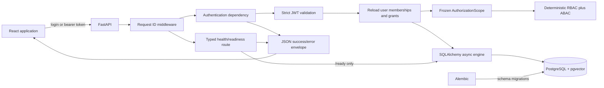
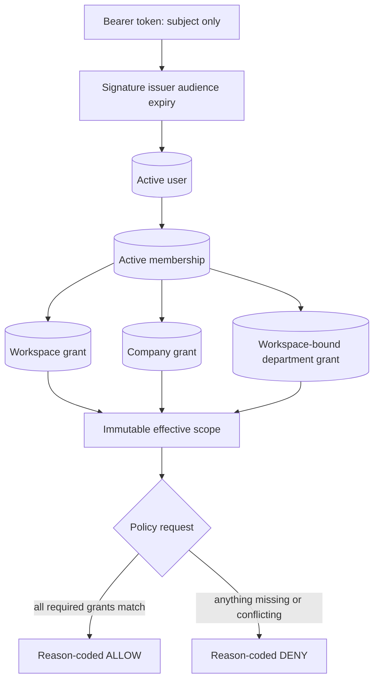

# Step 2 Architecture

## Scope

This document describes the Step 1 foundation plus Playbook Step 2 identity and deterministic
authorization. Document ingestion and all later capabilities remain absent.



## Authentication and authorization path

1. The browser posts only email and password to `/api/auth/login`; extra fields are rejected.
2. The backend performs Argon2 verification. Unknown users take a dummy verification path and
   receive the same error as a wrong password.
3. A successful login receives a signed 15-minute JWT containing only `sub`, `iss`, `aud`, `iat`,
   `exp`, and `jti`.
4. `/api/auth/me` accepts a bearer token and validates the fixed algorithm, signature, issuer,
   audience, required claims, and expiry.
5. The backend reloads the user, all active memberships, tenant status, role, primary department,
   and grants from PostgreSQL. Token claims never supply authorization.
6. The repository creates frozen `TrustedIdentity` and `AuthorizationScope` objects. Each scope grant
   binds one membership to one workspace, its companies, departments, and capabilities.
7. Policy code intersects capability, workspace, company, department, and role. Missing information
   denies by default and every result has a stable reason code.
8. The frontend displays the returned scope. Its protected route improves UX but does not authorize
   backend data.



## Backend request path

1. Uvicorn passes a request to FastAPI.
2. `RequestIDMiddleware` validates `X-Request-ID` or creates a UUID.
3. The route returns a Pydantic response model. `/ready` first calls the database readiness probe.
4. Expected and unexpected exceptions pass through centralized safe-error handlers.
5. The response includes the same request ID in JSON and the `X-Request-ID` header.
6. A structured log records request metadata after completion, without query strings or bodies.

Success shape:

```json
{
  "data": { "status": "healthy" },
  "request_id": "f6d8..."
}
```

Error shape:

```json
{
  "error": {
    "code": "service_unavailable",
    "message": "Service is not ready."
  },
  "request_id": "f6d8..."
}
```

## Frontend state flow

React Router renders the shared header, route outlet, and footer. The home route starts one abortable
health request through `getJson`. The client validates the envelope's basic shape and converts HTTP,
network, and invalid-response failures into a typed `ApiError`. `BackendHealth` renders a distinct
loading, online, or offline state.

## Database flow

The `db` Compose service exposes local PostgreSQL. Alembic reads the same environment-backed URL as
the application. Its initial reversible migration enables pgvector; SQLAlchemy metadata is empty.
Step 2 adds tenants, companies, departments, roles, users, memberships, and three dimension-specific
grant tables. The development seed writes only synthetic rows with deterministic IDs. `/ready`
still executes only `SELECT 1`.

## Trust boundaries

- The browser and all request headers are untrusted.
- Environment configuration is operational input and is validated by Pydantic.
- PostgreSQL connectivity is not exposed as raw errors.
- The request ID is correlation metadata, never proof of identity or authority.
- JWTs prove only a subject reference; database state determines current authority.
- Workspace, company, and department grants remain bound rather than flattened into client-editable
  arrays.
- A role alone never grants query access. Nora's Admin role has no query department grant.
- Uvicorn's query-string access log is disabled; the application emits metadata-only request logs.
