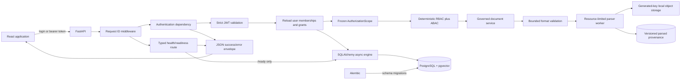
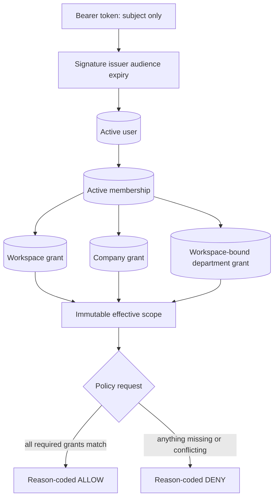
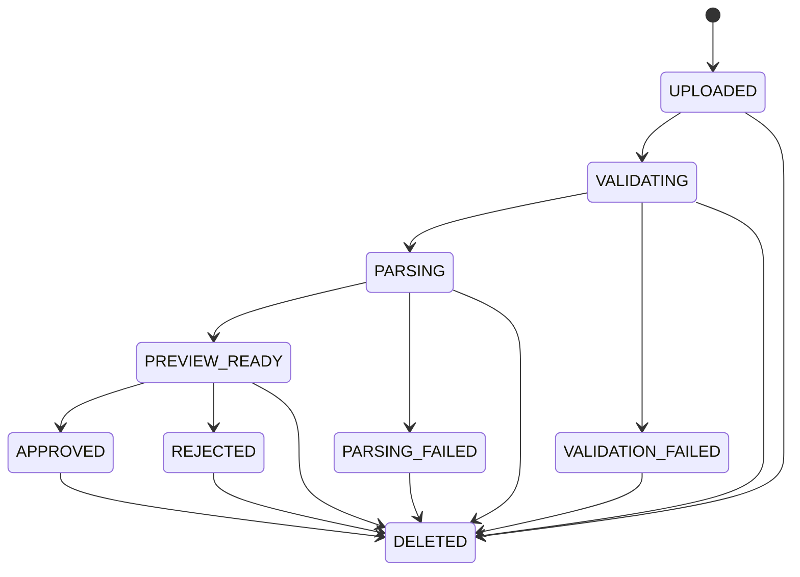

# Step 3 Architecture

## Scope

This document describes the Step 1 foundation, Step 2 identity/authorization, and Step 3 governed
synthetic-document ingestion. Retrieval and all later capabilities remain absent.



## Authentication and authorization path

1. The browser posts only email and password to `/api/auth/login`; extra fields are rejected.
2. The backend performs Argon2 verification. Unknown users take a dummy verification path and
   receive the same error as a wrong password.
3. A successful login receives a signed 15-minute JWT containing only `sub`, `iss`, `aud`, `iat`,
   `exp`, and `jti`.
4. `/api/auth/me` accepts a bearer token and validates the fixed algorithm, signature, issuer,
   audience, required claims, and expiry.
5. The backend reloads the user, all active memberships, tenant status, role, primary department,
   and grants from PostgreSQL. Token claims never supply authorization.
6. The repository creates frozen `TrustedIdentity` and `AuthorizationScope` objects. Each scope grant
   binds one membership to one workspace, its companies, departments, and capabilities.
7. Policy code intersects capability, workspace, company, department, and role. Missing information
   denies by default and every result has a stable reason code.
8. The frontend displays the returned scope. Its protected route improves UX but does not authorize
   backend data.



## Backend request path

1. Uvicorn passes a request to FastAPI.
2. `RequestIDMiddleware` validates `X-Request-ID` or creates a UUID.
3. The route returns a Pydantic response model. `/ready` first calls the database readiness probe.
4. Expected and unexpected exceptions pass through centralized safe-error handlers.
5. The response includes the same request ID in JSON and the `X-Request-ID` header.
6. A structured log records request metadata after completion, without query strings or bodies.

Success shape:

```json
{
  "data": { "status": "healthy" },
  "request_id": "f6d8..."
}
```

Error shape:

```json
{
  "error": {
    "code": "service_unavailable",
    "message": "Service is not ready."
  },
  "request_id": "f6d8..."
}
```

## Frontend state flow

React Router renders the shared header, route outlet, and footer. The home route starts one abortable
health request through `getJson`. The client validates the envelope's basic shape and converts HTTP,
network, and invalid-response failures into a typed `ApiError`. `BackendHealth` renders a distinct
loading, online, or offline state.

The nested `/admin/documents` route mounts only when a current grant contains `MANAGE_UPLOADS`.
After mounting it loads a dedicated backend-derived options contract and the scoped management
library. The form cascades tenant to company and department to the allowed
visibility/classification pair. Native XHR reports upload-byte progress; subsequent job polling is
recursive, abortable, and non-overlapping. The page owns selection, preview, mutations, and refresh
state while child upload, library, preview, badge, and deletion components remain controlled.

## Document ingestion path

1. The route validates strict JSON metadata inside multipart form data, validates the idempotency
   header, and authorizes the target workspace/company before reading the file body.
2. Validation bounds bytes and checks the sanitized filename, extension, declared MIME, signature,
   PDF safety, CSV structure, and OOXML container contents. Invalid attempts persist only safe
   metadata and a stable failure code.
3. Accepted bytes receive a generated UUID-only storage key. The local adapter confines writes to
   its root, uses private permissions and an atomic promotion, and verifies size/checksum.
4. A spawned worker applies wall-clock and process resource limits. PDF output contains numbered
   pages. XLSX/CSV output contains sheets, numbered rows, coordinates, value kinds, and a
   `formula_like` flag; it never executes formulas.
5. The service writes parsed provenance and advances the version/job together to `PREVIEW_READY`.
   Version-addressed preview is then available; approval or rejection is legal only from that state.
6. Initial uploads deduplicate on checksum plus canonical scope metadata. A separate endpoint creates
   explicit versions. Actor/idempotency-key plus request fingerprint makes exact retries stable and
   conflicting reuse fail safely.
7. Deletion marks the logical document and every version `DELETED`, clears the approved pointer,
   commits immediate unavailability, and then performs best-effort object cleanup with audited
   failures.



## Database flow

The `db` Compose service exposes local PostgreSQL. Alembic reads the same environment-backed URL as
the application. Its initial reversible migration enables pgvector; SQLAlchemy metadata is empty.
Step 2 adds tenants, companies, departments, roles, users, memberships, and three dimension-specific
grant tables. Step 3 adds logical documents, versions, ingestion jobs, parsed pages, parsed sheets,
rows, cells, and document audit events. The development seed writes only synthetic identity rows;
documents are created through governed ingestion. `/ready` still executes only `SELECT 1`.

## Trust boundaries

- The browser and all request headers are untrusted.
- Environment configuration is operational input and is validated by Pydantic.
- PostgreSQL connectivity is not exposed as raw errors.
- The request ID is correlation metadata, never proof of identity or authority.
- JWTs prove only a subject reference; database state determines current authority.
- Workspace, company, and department grants remain bound rather than flattened into client-editable
  arrays.
- A role alone never grants query access. Nora's Admin role has no query department grant.
- Uvicorn's query-string access log is disabled; the application emits metadata-only request logs.
- Uploaded filenames and file contents never become storage paths, authority inputs, audit metadata,
  or log fields. Generated storage keys are server-owned.
- Approval changes lifecycle state only. It does not grant `QUERY_DOCUMENTS` or invoke retrieval.
- Parser output is untrusted display data and is rendered as React text, never HTML or executable
  spreadsheet content.
